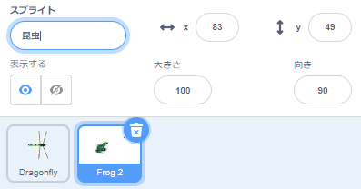
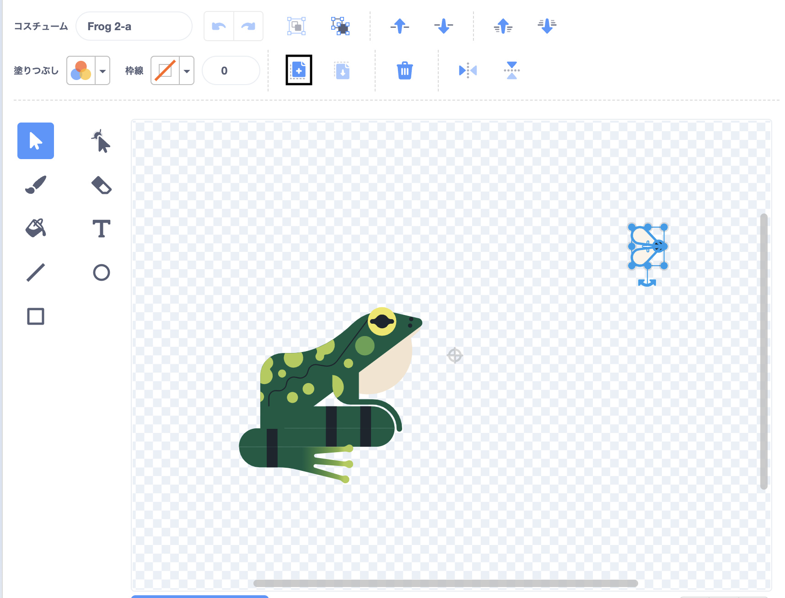
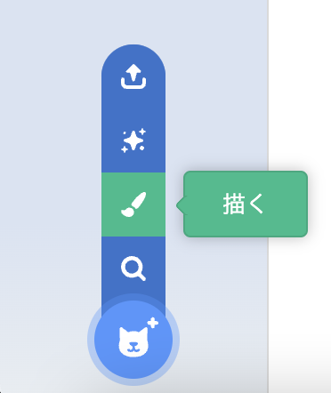
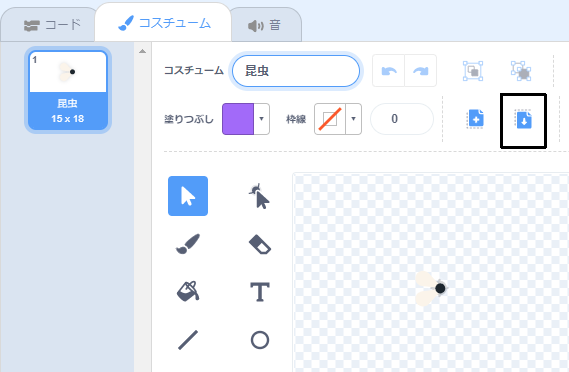
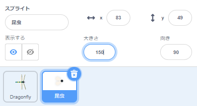

## 食べるハエ

<div style="display: flex; flex-wrap: wrap">
<div style="flex-basis: 200px; flex-grow: 1; margin-right: 15px;">
トンボが食べる昆虫を追加します。 
</div>
<div>
{:width="300px"}
</div>
</div>

<p style="border-left: solid; border-width:10px; border-color: #0faeb0; background-color: aliceblue; padding: 10px;">
ゲーム内で勝手に動き回るキャラクターを、モビールを略して<span style="color: #0faeb0">**モブ**</span>と呼ぶことがある。 モブがいるゲームを思いつきますか？</p>

**Frog 2**のスプライトにハエがいるので、それを利用します。

--- task ---

プロジェクトに **Frog 2** のスプライトを追加しましょう。 スプライトの名前を`昆虫`に変更します。




--- /task ---

カエルではなく、ハエだけが必要です。

--- task ---

**コスチューム** タブをクリックします。 ハエをクリックして選択し、**コピー**アイコンをクリックします。



--- /task ---

--- task ---

**描く** オプションを使用して、スプライトに新しいコスチュームを追加します。



--- /task ---

--- task ---

**貼り付け** アイコンをクリックして、ハエを新しいコスチュームに貼り付けます。 ハエを**中央**にドラッグして、十字線と一直線になるようにします。

コスチュームの名前を`昆虫`に変更し、他のコスチュームは必要ないので削除してください。



--- /task ---

--- task ---

ハエのサイズを大きくして、見やすく、捕まえやすくします。



--- /task ---

--- task ---

**コード**タブをクリックし、**昆虫**スプライトが飛び回るスクリプトを追加してください。


```blocks3
when flag clicked
forever
move [3] steps
if on edge, bounce
end
```

`もし端に着いたら、跳ね返る`{:class="block3motion"} ブロックは、スプライトがステージの端に到達したかどうかをチェックし、到達していれば別の方向にスプライトを向けます。

--- /task ---

`もし`{:class="block3control"}**昆虫**スプライトが**Dragonfly**スプライトに食べられたら、`隠す`{:class="block3looks"} ブロックで隠します。

--- task ---

`もし`{:class="block3control"}ブロックを**昆虫**スプライトの移動スクリプトに追加します。


```blocks3
when flag clicked
forever
move [3] steps
if on edge, bounce
+if < > then 
end
```
--- /task ---

`もし`{:class="block3control"} には六角形の入力があります。 これは、ここに**条件** を置くことができることを意味します。

`もし`{:class="block3control"} ブロックが実行されると、Scratchは条件をチェックします。 条件が「真」`なら`{:class="block3control"}、`もし`{:class="block3control"}ブロックの中のコードが実行されます。

虫が`もし`{:class="block3control"}**Dragonfly**のスプライトに`に触れたら`{:class="block3sensing"}`隠す`{:class="block3looks"}

--- task ---

`[Dragonfly v] に触れた`{:class="block3sensing"} を `もし`{:class="block3control"} ブロックにドラッグしてください。 `隠す`{:class="block3looks"} ブロックを`もし`{:class="block3control"}ブロックの中に入れます。


```blocks3
when flag clicked
forever
move [3] steps
if on edge, bounce
+if <touching [Dragonfly v] ?> then // 「マウスのポインター」から変更
+hide // 食べられた
end
```

--- /task ---

--- task ---

**テスト：** コードをテストし、トンボを制御してハエを食べてみましょう。 ハエが消えるはずです。

--- /task ---

ハエを一匹しか食べられないのなら、トンボはあまり大きくなれません！

--- task ---

ステージ上の`どこかの場所へ行く`{:class="block3motion"}ブロックを追加し、スプライトを`待つ`{:class="block3control"}で1秒間待機させてから`表示する`{:class="block3looks"}で表示します。


```blocks3
when flag clicked
+show // 最初に表示
forever
move [3] steps
if on edge, bounce
if <touching [Dragonfly v] ?> then
hide
+go to (random position v)
+wait [1] seconds
+show // 新しいハエのように見せる
end
end
```

--- /task ---

--- task ---

**テスト：** トンボがたくさんのハエを食べることができることをテストします。

スタートした時に表示されるよう、`表示する`{:class="block3looks"} ブロックが追加されていることを確認します。

--- /task ---

**ヒント：** コードを追加している間、トンボを静かにしたい場合は、ステージの上にある赤い **停止** ボタンをクリックできます。

--- save ---
