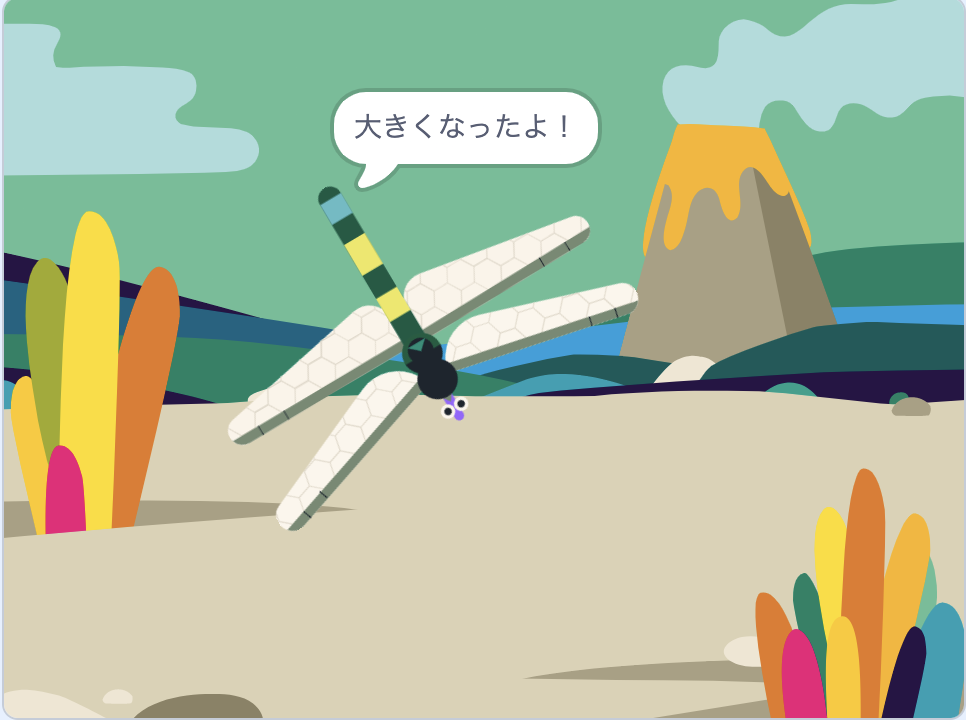

## フルサイズに成長する

<div style="display: flex; flex-wrap: wrap">
<div style="flex-basis: 200px; flex-grow: 1; margin-right: 15px;">
トンボがハエを食べると成長し、フルサイズになると停止します
</div>
<div>
{:width="300px"}
</div>
</div>

The Dragonfly needs to grow when it eats a fly.

何かが起こったことを他のスプライトに知らせる必要があるときは、[呪文の送信](https://projects.raspberrypi.org/en/projects/broadcasting-spells){:target="_blank"}で行ったように、`()を送る`{:class="block3events"}ブロックを使用することができます。

--- task ---

`()を送信する`ブロックを**昆虫**スプライトに追加し、新しいメッセージ`エサ`{:class="block3events"}をセットします：


```blocks3
when flag clicked
show // show at the start
forever
move [3] steps
if on edge, bounce
if <touching [Dragonfly v] ?> then
+broadcast [food v]
hide
go to (random position v)
wait [1] seconds
show
end
end
```
--- /task ---

**Dragonfly** スプライトは、 `エサ`{:class="block3events"}メッセージを受信したときに成長する必要があります。

--- task ---

**Dragonfly** スプライトを選択し、次のスクリプトを追加します。


```blocks3 
when I receive [food v]
change size by [5]
```

--- /task ---

--- task ---

トンボに**Chomp**という音を追加し、虫が食べられた時に`再生`{:class="block3sound"}します。

```blocks3 
when I receive [food v]
+start sound [Chomp v]
change size by [5]
```
--- /task ---

--- task ---

**テスト：** プロジェクトを実行して、ハエを食べると、トンボが成長し音が鳴るのをテストします。

--- /task ---

トンボの大きさがフルサイズに達すると、ゲームはあなたを祝福して停止します。

--- task ---

`もし`{:class="block3control"}ブロックを追加する。

```blocks3
when I receive [エサ v]
start sound [Chomp v]
change size by [5]
+if <[ ] = [ ]> then
end
```

--- /task ---

`大きさ`{:class="block3looks"}`=`{:class="block3operators"}`100％`の場合、トンボはフルサイズです。

--- task ---

まず、六角形の入力に`=`{:class="block3operators"}という演算子を追加します。

```blocks3
when I receive [food v]
start sound [Chomp v]
change size by [5]
+if <[ ] = [ ]> then
end
```
--- /task ---

--- task ---

組み込みの`大きさ`{:class="block3looks"}変数を追加して、値`100`を入力して条件構築を終了します。

```blocks3
when I receive [food v]
start sound [Chomp v]
change size by [5]
+if <(size) = [100]> then
end
```
--- /task ---

--- task ---

`もし`{:class="block3control"} 真 `ならば`{:class="block3control"} '終わり' `を送信する`{:class="block3events"}と`大きくなったよ！`と `言う`{:class="block3looks"} ブロックを追加する。

最後に、`すべてを止める`{:class="block3control"} ブロックを追加して、他のトンボスクリプトを停止させます。

```blocks3
when I receive [food v]
start sound [Chomp v]
change size by [5]
if <(size) = [100]> then
+broadcast [end v]
+say [I got to full size!]
+stop [other scripts in sprite v] // change from 'all'
end
```
--- /task ---

--- task ---

現時点では、プロジェクトが終了した後もハエは動きます。 このスクリプトを**昆虫**スプライトに追加する。


```blocks3
when I receive [end v]
stop [other scripts in sprite v]
```

--- /task ---

--- task ---

**テスト：** 緑色の旗をクリックし、トンボがフルサイズになるまでハエを食べ続けます。

--- /task ---

--- save ---
