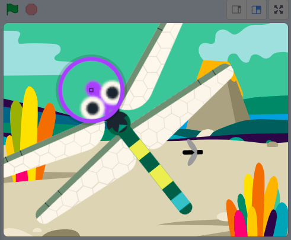

## より多くのエサ

<div style="display: flex; flex-wrap: wrap">
<div style="flex-basis: 200px; flex-grow: 1; margin-right: 15px;">
トンボには昆虫の選択が必要です。
</div>
<div>
{:width="300px"}
</div>
</div>

--- task ---

ステージの下のスプライトリストで **昆虫** スプライトを右クリックし、 **複製** します。


--- /task ---

この昆虫がハエと違うように見えると役立ちます。

--- task ---

**コスチューム** タブをクリックします。

**選択：**別の飛ぶ昆虫を作成する方法。
+ **塗りつぶし** ツールでこの昆虫の色を変更する
+ 昆虫のコスチュームを自分で**描く**
+ 別の昆虫コスチュームをScratchから**追加**する

--- /task ---

昆虫はトンボの羽や尻尾に触れただけでも食べられてしまいます。

よりリアルなゲームにするために、昆虫がトンボの口に食べられるように修正します。 `()色に触れた`{:class="block3sensing"} ブロックを使って、**Dragonfly**の特定の色に触れたときだけ、その虫が食べられるようにすることができます。

--- task ---

**Dragonfly**スプライトを選択し、**コスチューム**タブをクリックします。

塗りつぶしツールで**Dragonfly**の口を塗りつぶす。 紫を使用しました：


--- /task ---

**昆虫2**スプライトが**Dragonfly**スプライトに触れていて、`かつ`{:class="block3operators"}トンボの口の色に触れていることを確認する必要があります。

--- task ---

**昆虫2**スプライトを選択し、**コード**タブをクリックします。

`かつ`{:class="block3operators"} ブロックを `もし`{:class="block3control"} ブロックの中にドラッグします。

`<[Dragonfly v]に触れた>`{:class="block3sensing"}ブロックが飛び出しますので、これを`かつ`{:class="block3operators"}ブロックの左側にドラッグしてください。


```blocks3
when flag clicked
show
forever
move [3] steps 
if on edge, bounce
+if <<touching [Dragonfly v] ?> and <>> then
broadcast [エサ v]
hide
go to (random position v)
show
end
end
```

--- /task ---

--- task ---

`()色に触れた`{:class="block3sensing"}ブロックを`かつ`{:class="block3operators"}ブロックの右にドラッグしてください。


```blocks3
when flag clicked
show
forever
move [3] steps
if on edge, bounce
+if <<touching [Dragonfly v] ?> and <touching color (#9966ff) ?>> then
broadcast [エサ v]
hide
go to (random position v)
show
end
end
```

トンボの口に選択された色がない場合は、色のついた丸い部分をクリックし、**スポイト**ツールをクリックして色を選択します。


ステージ上のトンボの口をクリックして、色を合わせて設定します：



**ヒント：** これが難しい場合は、**Dragonfly**スプライトのサイズを大きくしてください。

--- /task ---

--- task ---

**テスト：**ここで、トンボが2番目の昆虫を口だけでしか食べられないことをテストします。

お好みで、最初の**昆虫**をトンボの口でないと食べられないように変更することもできます。

--- /task ---

--- save ---

