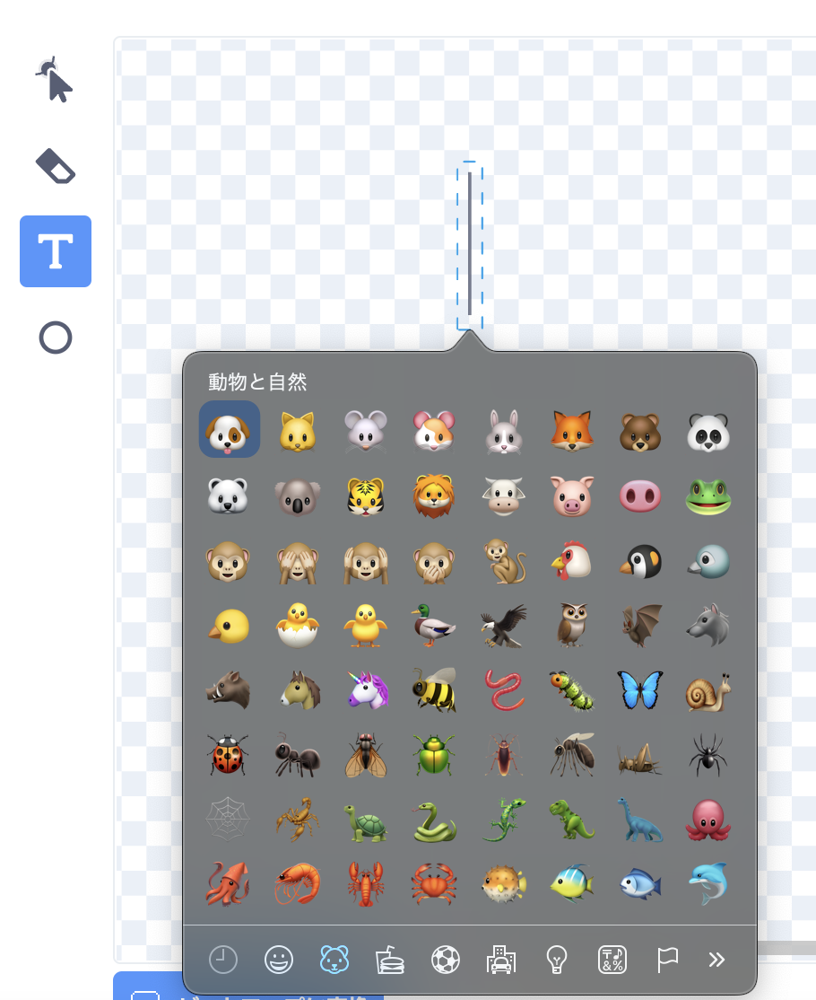

## プロジェクトをアップグレードする

このステップでは、昆虫を追加して、プロジェクトの外観と動作を変更してみてください。

{:width="300px"}

### 昆虫を追加する

昆虫を追加する. トンボに捕まりにくいように、動きを速くする必要があるかもしれません。

自分で虫を描いたり、絵文字の蚊を追加してみたりできます！

--- task ---

絵文字キーボードを使用して、**蚊の絵文字** スプライトを追加します。

既存の**昆虫**スプライトを複製し、**コスチューム**タブをクリックします。 **描く**で新しいコスチュームを作り、**テキスト**ツールを選択します。 テキストを入力する代わりに、オペレーティングシステムの絵文字キーボードショートカットを使用します。

Windows - Windowsキー + '.' MacOS - ctrl + cmd + スペース Linux - ctrl + '.'

**蚊** 絵文字を選択して、ペイントエディタに挿入します。 **選択**(矢印) ツールを使って、蚊の中心を合わせたり、サイズを変えたり、回転させたりして、納得のいくまで調整します。

**ヒント：** 絵文字はコンピューターによって異なる場合があるため、タブレットとデスクトップコンピューターでは同じように見えない場合があります。 一部の絵文字は一部のコンピューターでは使用できませんが、最近のほとんどのコンピューターはそれらをサポートします。

--- /task ---

--- task ---

バックパックを使って、「トンボを育てよう」プロジェクトに参加した友だちと昆虫を交換しよう。

[[[scratch-backpack]]]

--- /task ---

--- task ---

**ヒント：** すべてのスプライトとコスチュームにわかりやすい名前が付いていることを確認します。 後で戻ってきた場合に、プロジェクトを理解しやすくなります。

**ヒント：** コードがコード領域にきちんと配置されていることを確認してください。 コード領域を右クリックし、 **ブロック** をクリーンアップを選択して、Scratchでコードを整理します。

--- /task ---

--- collapse ---
---
title: 完成したプロジェクト
---

[完成したプロジェクトはこちら](https://scratch.mit.edu/projects/521688740/){:target="_blank"}で確認できます。

--- /collapse ---

--- save ---
