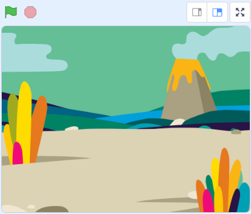
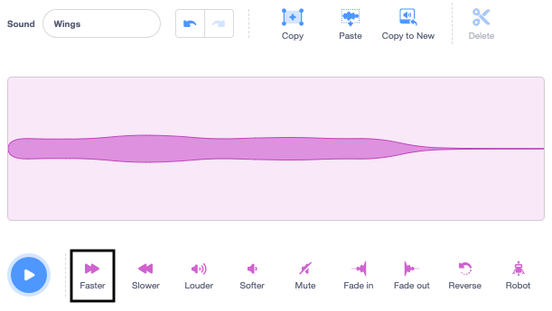

## ದೃಶ್ಯವನ್ನು ಹೊಂದಿಸಿ

<div style="display: flex; flex-wrap: wrap">
<div style="flex-basis: 200px; flex-grow: 1; margin-right: 15px;">
ನೀವು ದೃಶ್ಯವನ್ನು ಹೊಂದಿಸುವಿರಿ. ನೀವು ಹಿನ್ನೆಲೆಯನ್ನು ಆಯ್ಕೆ ಮಾಡಿಕೊಳ್ಳಿ ಮತ್ತು Stage ಸುತ್ತ ಮೌಸ್-ಪಾಯಿಂಟರ್‌ ಅನುಸರಿಸುವ ಡ್ರಾಗನ್‌ಫ್ಲೈ ಸೇರಿಸಿ.
</div>
<div>
{:width="300px"}
</div>
</div>

--- task ---

[ಡ್ರಾಗನ್‌ ಫ್ಲೈ ಬೆಳೆಸಿ ಪ್ರಾರಂಭಿಕ ಪ್ರಾಜೆಕ್ಟ್](https://scratch.mit.edu/projects/535695413/editor){:target="_blank"} ತೆರೆಯಿರಿ. Scratch ಇನ್ನೊಂದು ಬ್ರೌಸರ್ ಟ್ಯಾಬ್‌ನಲ್ಲಿ ತೆರೆಯುತ್ತದೆ.

[[[working-offline]]]

--- /task ---

<p style="border-left: solid; border-width:10px; border-color: #0faeb0; background-color: aliceblue; padding: 10px;">
ಜಗತ್ತಿನೆಲ್ಲೆಡೆ <span style="color: #0faeb0">**ಡ್ರಾಗನ್‌ಫ್ಲೈಗಳು**</span> ಕಂಡುಬರುತ್ತವೆ ಮತ್ತು ಅವುಗಳು ಸುಮಾರು 300 ಮಿಲಿಯನ್‌ ವರ್ಷಗಳಿಂದಲೂ ಇವೆ!</p>

--- task ---

**ಆಯ್ಕೆ ಮಾಡಿ:** **Choose a Backdrop** ಕ್ಲಿಕ್‌ ಮಾಡಿ ಮತ್ತು ನಿಮ್ಮ ಆಯ್ಕೆಯ ಹಿನ್ನೆಲೆಯನ್ನು ಸೇರಿಸಿ. ನಾವು **Jurassic** ಹಿನ್ನೆಲೆ ಉಪಯೋಗಿಸಿದ್ದೇವೆ.




--- /task ---

--- task ---

**Choose a Sprite** ಕ್ಲಿಕ್‌ ಮಾಡಿ ಮತ್ತು `dragonfly` ಹುಡುಕಿ, ನಂತರ **Dragonfly** ಸ್ಪ್ರೈಟ್‌ ಸೇರಿಸಿ.


--- /task ---

--- task ---

**Dragonfly** ಸ್ಪ್ರೈಟ್‌ ಮೌಸ್-ಪಾಯಿಂಟರ್‌ (ಅಥವಾ ನಿಮ್ಮ ಬೆರಳನ್ನು) ಅನುಸರಿಸುವಂತೆ ಮಾಡಲು ಬರಹವನ್ನು ಸೇರಿಸಿ:


```blocks3
when flag clicked
set size to [25] % // ಸಣ್ಣದಾಗಿ ಆರಂಭಿಸಲು
forever
point towards (mouse-pointer v)
move [5] steps
end
```
--- /task ---

--- task ---

**ಪರೀಕ್ಷೆ:** ಹಸಿರು ಬಾವುಟ ಕ್ಲಿಕ್‌ ಮಾಡಿ ಮತ್ತು **Dragonfly** ಸ್ಪ್ರೈಟ್‌ Stage ಸುತ್ತ ಚಲಿಸುವಂತೆ ಮಾಡಿ. ನೀವು ನಿರೀಕ್ಷಿಸಿದಂತೆ ಡ್ರಾಗನ್‌ಫ್ಲೈ ಚಲಿಸುತ್ತಿದೆಯೇ?

--- /ಕಾರ್ಯ ---

Dragonfly ಉಡುಪು ಬಲ ಭಾಗಕ್ಕೆ ಮುಖಮಾಡಿಲ್ಲ, ಅದರಿಂದ **Dragonfly** ಸ್ಪ್ರೈಟ್‌ನ ತಲೆ ಮೌಸ್-ಪಾಯಿಂಟರ್‌ ಕಡೆಗೆ ಸೂಚಿಸುತ್ತಿಲ್ಲ.

--- task ---

**Costumes** ಟ್ಯಾಬ್‌ ಮೇಲೆ ಕ್ಲಿಕ್‌ ಮಾಡಿ ಮತ್ತು **Select** (ಬಾಣ) ಟೂಲ್‌ನ್ನು ಉಡುಪು ಆಯ್ಕೆ ಮಾಡಲು ಉಪಯೋಗಿಸಿ. **Dragonfly** ಉಡುಪು ಬಲ ಭಾಗಕ್ಕೆ ಮುಖಮಾಡುವಂತೆ ತಿರುಗಿಸಲು ಆಯ್ಕೆ ಮಾಡಿದ ಉಡುಪಿನ ಕೆಳಭಾಗದಲ್ಲಿರುವ **Rotate** ಟೂಲ್‌ ಉಪಯೋಗಿಸಿ.


--- /task ---

--- task ---

**ಪರೀಕ್ಷೆ:** ಹಸಿರು ಬಾವುಟವನ್ನು ಕ್ಲಿಕ್‌ ಮಾಡಿ ಮತ್ತು ಈಗ ಡ್ರಾಗನ್‌ಫ್ಲೈ ಹೇಗೆ ಚಲಿಸುತ್ತದೆ ಎಂದು ನೋಡಿ.

--- /task ---

ಡ್ರಾಗನ್‌ಫ್ಲೈ ರೆಕ್ಕೆಗಳು ಕಂಪಿಸಿದಾಗ ರೆಕ್ಕೆಬಡಿತದ ಶಬ್ದ ಮಾಡುತ್ತವೆ. Scratchನಲ್ಲಿ ನೀವು ನಿಮ್ಮದೇ ಧ್ವನಿಯನ್ನು ರಚಿಸಲು ಧ್ವನಿಯನ್ನು ಎಡಿಟ್‌ ಮಾಡಬಹುದು.

--- task ---

**Crank** ಧ್ವನಿಯನ್ನು **Dragonfly** ಸ್ಪ್ರೈಟ್‌ಗೆ ಸೇರಿಸಿ.

[[[generic-scratch3-sound-from-library]]]


**Play** ಬಟನ್‌ ಕ್ಲಿಕ್‌ ಮಾಡಿ ನೀವು ಧ್ವನಿಯನ್ನು ಕೇಳಬಹುದು.

--- /task ---

**Crank** ಧ್ವನಿಯು ಡ್ರಾಗನ್‌ಫ್ಲೈ ರೆಕ್ಕೆಗಳಿಗೆ ಬಹಳ ಉದ್ದ ಮತ್ತು ನಿಧಾನವಾಗಿದೆ.

--- task ---

ನಿಮ್ಮ ಕರ್ಸರ್‌ ಅಥವಾ ಬೆರಳನ್ನು ಉಪಯೋಗಿಸಿಕೊಂಡು ಧ್ವನಿಯ ಅಂತ್ಯವನ್ನು ಆಯ್ಕೆ ಮಾಡಿ.

ಆಯ್ಕೆ ಮಾಡಿಕೊಂಡ ಭಾಗಕ್ಕಷ್ಟೆ ಹೊಸ ಧ್ವನಿಯನ್ನು ಮಾಡಲು **Copy to New** ಕ್ಲಿಕ್‌ ಮಾಡಿ:


ನಿಮ್ಮ ಹೊಸ ಧ್ವನಿಯನ್ನು **Crank2** ದಿಂದ `Wings` ಎಂದು ಮರುನಾಮಕರಣ ಮಾಡಿ.


--- /task ---

--- task ---

ಹೊಸ ಧ್ವನಿಯನ್ನು ನುಡಿಸಿ. ಫಲಿತಾಂಶವು ನಿಮಗೆ ಇಷ್ಟವಾಗುವವರೆಗೆ ಕೆಲವು ಬಾರಿ **Faster** ಬಟನ್‌ ಕ್ಲಿಕ್‌ ಮಾಡಿ:



--- /task ---

--- task ---

ನಿಮಗಿಷ್ಟವಾದರೆ, ನೀವು **Wings** ಧ್ವನಿಯ ಅಂತ್ಯವನ್ನು ಆಯ್ಕೆ ಮಾಡಬಹುದು ಮತ್ತು ನಂತರ ಅದನ್ನು ತೆಗದುಹಾಕಲು **Delete** ಕ್ಲಿಕ್‌ ಮಾಡಬಹುದು:


--- /task ---

--- task ---

ಈಗ ಡ್ರಾಗನ್‌ಫ್ಲೈ ಚಲಿಸುವಾಗ **Wings** ಧ್ವನಿಯನ್ನು ನುಡಿಸಲು ಬ್ಲಾಕ್‌ ಸೇರಿಸಿ:


```blocks3
when flag clicked
set size to [25] %
forever
+start sound [Wings v]
point towards (mouse-pointer v)
move [5] steps
end
```
--- /task ---

--- task ---

**ಪರೀಕ್ಷೆ:** ನಿಮ್ಮ ಡ್ರಾಗನ್‌ಫ್ಲೈ ಚಲನೆಯನ್ನು ಮತ್ತು ಧ್ವನಿಯ ಪರಿಣಾಮವನ್ನು ಪ್ರಯತ್ನಿಸಿ.

--- /task ---

--- save ---
