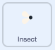

## ತಿನ್ನಲು ಒಂದು ನೊಣ

<div style="display: flex; flex-wrap: wrap">
<div style="flex-basis: 200px; flex-grow: 1; margin-right: 15px;">
ಡ್ರಾಗನ್‌ಫ್ಲೈ ತಿನ್ನಲು ನೀವು ಕೀಟವನ್ನು ಸೇರಿಸುತ್ತೀರಿ. 
</div>
<div>
{:width="300px"}
</div>
</div>

<p style="border-left: solid; border-width:10px; border-color: #0faeb0; background-color: aliceblue; padding: 10px;">
ಆಟಗಳಲ್ಲಿ ತಾವೇ ಸ್ವತಃ ಸುತ್ತಲೂ ಚಲಿಸುವ ಪಾತ್ರಗಳನ್ನು ಕೆಲವೊಮ್ಮೆmobiles ಗೆ ಬದಲಾಗಿ ಚಿಕ್ಕದಾಗಿ<span style="color: #0faeb0">**ಮೊಬ್ಸ್**</span>ಎಂದು ಕರೆಯಲಾಗುತ್ತದೆ. Mobs ಹೊಂದಿರುವ ಯಾವುದಾದರೂ ಆಟವನ್ನು ನೀವು ಯೋಚಿಸಬಹುದೇ?</p>

ನೀವು ಉಪಯೋಗಿಸಬಹುದಾದ **Frog 2**ಸ್ಪ್ರೈಟ್‌ನಲ್ಲಿ ನೋಣವಿದೆ.

--- task ---

**Frog 2** ಸ್ಪ್ರೈಟ್‌ನ್ನು ನಿಮ್ಮ ಪ್ರಾಜೆಕ್ಟ್‌ಗೆ ಸೇರಿಸಿ. ಸ್ಪ್ರೈಟ್‌ನ್ನು `Insect` ಎಂದು ಮರುನಾಮಕರಣ ಮಾಡಿ:


--- /task ---

ನಿಮಗೆ ನೊಣ ಮಾತ್ರ ಬೇಕು, ಕಪ್ಪೆ ಅಲ್ಲ.

--- task ---

**Costumes** ಟ್ಯಾಬ್ ಮೇಲೆ ಕ್ಲಿಕ್ ಮಾಡಿ. ನೊಣವನ್ನು ಆಯ್ಕೆ ಮಾಡಲು ಅದರ ಮೇಲೆ ಕ್ಲಿಕ್‌ ಮಾಡಿ ಮತ್ತು **Copy** ಐಕಾನ್‌ ಮೇಲೆ ಕ್ಲಿಕ್‌ ಮಾಡಿ.


--- /task ---

--- task ---

**Paint** ಆಯ್ಕೆಯನ್ನು ಉಪಯೋಗಿಸಿ ಸ್ಪ್ರೈಟ್‌ಗೆ ಹೊಸ ಉಡುಪನ್ನು ಸೇರಿಸಿ:


--- /task ---

--- task ---

ಸ್ಪ್ರೈಟ್‌ನ್ನು ಹೊಸ ಉಡುಪಿನಲ್ಲಿ ಅಂಟಿಸಲು **Paste** ಐಕಾನ್‌ ಮೇಲೆ ಕ್ಲಿಕ್‌ ಮಾಡಿ. ಅದು ಕ್ರಾಸ್‌ಹೇರ್‌ ಜೊತೆಗೆ ಸಾಲಾಗಿ ನಿಲ್ಲುವಂತೆ, ನೊಣವನ್ನು **ಮಧ್ಯಕ್ಕೆ** ಎಳೆಯಿರಿ.

ನೀವು ನಿಮ್ಮ ಉಡುಪನ್ನು `Insect` ಎಂದು ಮರುನಾಮಕರಣ ಮಾಡಬಹುದು ಮತ್ತು ಉಳಿದ ಉಡುಪುಗಳು ನಿಮಗೆ ಬೇಡವಾದುದರಿಂದ ಅವುಗಳನ್ನು ಅಳಿಸಬಹುದು:


--- /task ---

--- task ---

ನೊಣವನ್ನು ಸುಲಭವಾಗಿ ನೋಡಿ ಹಿಡಿಯಲು ಆಗುವಂತೆ ಅದರ ಗಾತ್ರವನ್ನು ಹೆಚ್ಚಿಸಿ:


--- /task ---

--- task ---

**Code** ಟ್ಯಾಬ್‌ ಮೇಲೆ ಕ್ಲಿಕ್‌ ಮಾಡಿ ಮತ್ತು **Insect** ಸ್ಪ್ರೈಟ್‌ ಸುತ್ತಲೂ ಪುಟಿಯುವಂತೆ ಮಾಡಲು ಬರಹವನ್ನು ಸೇರಿಸಿ:



```blocks3
when flag clicked
forever
move [3] steps
if on edge, bounce
end
```

`if on edge, bounce`{:class="block3motion"} ಬ್ಲಾಕ್‌ ಸ್ಪ್ರೈಟ್‌ Stage ಅಂಚಿಗೆ ತಲುಪಿದೆಯೇ ಎಂದು ಪರಿಶೀಲಿಸುತ್ತದೆ ಮತ್ತು ಅದು ತಲುಪಿದ್ದರೆ ಸ್ಪ್ರೈಟ್‌ಗೆ ಬೇರೆ ದಿಕ್ಕನ್ನು ಸೂಚಿಸುತ್ತದೆ.

--- /task ---

**Dragonfly** ಸ್ಪ್ರೈಟ್‌ ಅದನ್ನು ತಿನ್ನುವುದರಿಂದ ನಿಮಗೆ **Insect** ಸ್ಪ್ರೈಟ್ `hide`{:class="block3looks"} `if`{:class="block3control"}‌ ಆಗಬೇಕು.

--- task ---

**Insect** ಸ್ಪ್ರೈಟ್‌ನ ಚಲನೆಯ ಬರಹಕ್ಕೆ `if`{:class="block3control"} ಬ್ಲಾಕ್‌ನ್ನು ಸೇರಿಸಿ:


```blocks3
when flag clicked
forever
move [3] steps
if on edge, bounce
+if < > then 
end
```
--- /task ---

`if`{:class="block3control"} ಷಡ್ಭುಜಾಕೃತಿಯ ಇನ್‌ಪುಟ್‌ ಹೊಂದಿದೆ. ಅದರ ಅರ್ಥ ನೀವು ಇಲ್ಲಿ **ಷರತ್ತು** ಹಾಕಬಹುದು.

`if`{:class="block3control"} ಬ್ಲಾಕ್‌ ರನ್‌ ಆದಾಗ, Scratch ಷರತ್ತನ್ನು ಪರಿಶೀಲಿಸುತ್ತದೆ. ಷರತ್ತು 'ಸರಿ' ಆಗಿದ್ದರೆ `if`{:class="block3control"} ಬ್ಲಾಕ್‌ ಒಳಗಿನ `then`{:class="block3control"} ಕೋಡ್‌ ರನ್‌ ಆಗುತ್ತದೆ.

ನಿಮಗೆ ಕೀಟವು `hide`{:class="block3looks"} ಆಗಬೇಕು`if`{:class="block3control"} ಅದು **Dragonfly** ಸ್ಪ್ರೈಟ್ `touching`{:class="block3sensing"}‌ ಆಗಿದ್ದರೆ.

--- task ---

`touching [Dragonfly v]`{:class="block3sensing"} ನ್ನು `if`{:class="block3control"} ಬ್ಲಾಕ್‌ ಒಳಗೆ ಎಳೆಯಿರಿ. `hide`{:class="block3looks"} ಬ್ಲಾಕ್‌ನ್ನು `if`{:class="block3control"} ಬ್ಲಾಕ್‌ ಒಳಗೆ ಸೇರಿಸಿ.


```blocks3
when flag clicked
forever
move [3] steps
if on edge, bounce
+if <touching [Dragonfly v] ?> then // 'mouse-pointer' ನಿಂದ ಬದಲಾಯಿಸಿ
+hide // ತಿನ್ನಲಾಗುತ್ತದೆ
end
```

--- /task ---

--- task ---

**ಪರೀಕ್ಷೆ:** ನಿಮ್ಮ ಕೋಡ್ ಅನ್ನು ಪರೀಕ್ಷಿಸಿ ಮತ್ತು ನೊಣವನ್ನು ತಿನ್ನಲು ಡ್ರ್ಯಾಗನ್‌ಫ್ಲೈಯನ್ನು ನಿಯಂತ್ರಿಸಿ. ನೊಣ ಕಣ್ಮರೆಯಾಗಬೇಕು.

--- /task ---

ಅದಕ್ಕೆ ಒಂದೇ ಒಂದು ನೊಣವನ್ನು ಮಾತ್ರ ತಿನ್ನಲು ಸಾಧ್ಯವಾಧರೆ ಡ್ರಾಗನ್‌ಫ್ಲೈ ತುಂಬಾ ದೊಡ್ಡದಾಗುವುದಿಲ್ಲ!

--- task ---

`go to a random position`{:class="block3motion"} ವೇದಿಕೆಯ ಮೇಲೆ ಬ್ಲಾಕ್ ಗಳನ್ನು ಸೇರಿಸಿ, ಮತ್ತು ನಿಮ್ಮ ಸ್ಪ್ರೈಟ್‌ ಒಂದು ಸೆಕೆಂಡುಗಳ ಕಾಲ `wait`{:class="block3control"} ಮಾಡುವಂತೆ ಮಾಡಿ ನಂತರ `show`{:class="block3looks"}:


```blocks3
when flag clicked
+show // ಪ್ರಾರಂಭದಲ್ಲಿ ತೋರಿಸಿ
forever
move [3] steps
if on edge, bounce
if <touching [Dragonfly v] ?> then
hide
+go to (random position v)
+wait [1] seconds
+show // ಹೊಸ ನೊಣದಂತೆ ಕಾಣಲು
end
end
```

--- /task ---

--- task ---

**ಪರೀಕ್ಷೆ:** ನಿಮ್ಮ ಡ್ರಾಗನ್‌ಫ್ಲೈ ಈಗ ತುಂಬಾ ನೊಣಗಳನ್ನು ತಿನ್ನಬಹುದೆಂದು ಪರೀಕ್ಷಿಸಿ.

ಪ್ರಾರಂಭದಲ್ಲಿ ತೋರಿಸಲು ನೀವು `show`{:class="block3looks"} ಬ್ಲಾಕ್‌ ಸೇರಿಸಿರುವುದನ್ನು ಖಚಿತಪಡಿಸಿಕೊಳ್ಳಿ.

--- /task ---

**ಸಲಹೆ:** ನೀವು ಇನ್ನಷ್ಟು ಕೋಡ್‌ ಸೇರಿಸುತ್ತಿರುವಾಗ ನಿಮಗೆ ಡ್ರಾಗನ್‌ಫ್ಲೈ ಸುಮ್ಮನಿರಬೇಕೆಂದರೆ, ನೀವು Stage ಮೇಲಿನ ಕೆಂಪು **Stop** ಬಟನ್‌ ಕ್ಲಿಕ್‌ ಮಾಡಬಹುದು.

--- save ---
