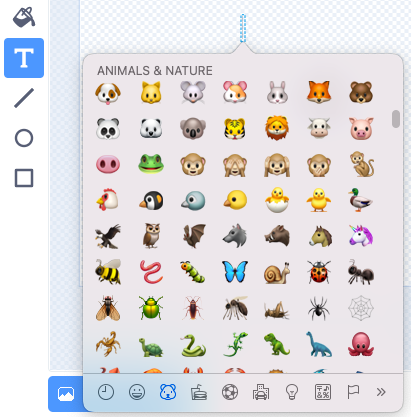

## ನಿಮ್ಮ ಪ್ರಾಜೆಕ್ಟ್‌ ಅಪ್‌ಗ್ರೇಡ್‌ ಮಾಡಿ

ಈ ಹಂತದಲ್ಲಿ, ಇನ್ನಷ್ಟು ಕೀಟಗಳನ್ನು ಸೇರಿಸಲು ಪ್ರಯತ್ನಿಸಿ, ನಿಮ್ಮ ಪ್ರಾಜೆಕ್ಟ್‌ ಹೇಗೆ ಕಾಣುತ್ತದೆ ಮತ್ತು ವರ್ತಿಸುತ್ತದೆ ಎಂಬುವುದನ್ನು ಬದಲಾಯಿಸಿ.

{:width="300px"}

### ಇನ್ನಷ್ಟು ಕೀಟಗಳನ್ನು ಸೇರಿಸಿ

ಇನ್ನಷ್ಟು ಕೀಟಗಳನ್ನು ಸೇರಿಸಿ. ನೀವು ಅವುಗಳು ವೇಗವಾಗಿ ಚಲಿಸುವಂತೆ ಮಾಡಬಹುದು, ಅದರಿಂದ ಡ್ರಾಗನ್‌ಫ್ಲೈಗೆ ಅವುಗಳನ್ನು ಹಿಡಿಯುವುದು ಕಷ್ಟವಾಗುತ್ತದೆ.

ನೀವು ನಿಮ್ಮ ಸ್ವಂತ ಕೀಟಗಳನ್ನು ಚಿತ್ರಿಸಬಹುದು ಅಥವಾ ಎಮೋಜಿ ಸೊಳ್ಳೆ ಸೇರಿಸಲು ಪ್ರಯತ್ನಿಸಬಹುದು!

--- task ---

**Mosquito emoji** ಸ್ಪ್ರೈಟ್ ಅನ್ನು ಸೇರಿಸಲು ಎಮೋಜಿ ಕೀಬೋರ್ಡ್ ಬಳಸಿ.

ಈಗಿರುವ **insect** ಸ್ಪ್ರೈಟ್‌ನ್ನು ನಕಲು ಮಾಡಿ ನಂತರ **Costumes** ಟ್ಯಾಬ್‌ ಮೇಲೆ ಕ್ಲಿಕ್‌ ಮಾಡಿ. ಹೊಸ ಉಡುಪನ್ನು **Paint** ಮಾಡಿ ಮತ್ತು **Text** ಟೂಲ್‌ ಆಯ್ಕೆಮಾಡಿ. ಅಕ್ಷರಗಳನ್ನು ಟೈಪ್‌ ಮಾಡುವ ಬದಲು, ನಿಮ್ಮ ಆಪರೇಟಿಂಗ್‌ ಸಿಸ್ಟಮ್‌ನ ಇಮೋಜಿ ಕೀಬೋರ್ಡ್‌ ಶಾರ್ಟ್‌ಕಟ್‌ ಉಪಯೋಗಿಸಿ:

Windows - Windows key + '.' 
MacOS - ctrl + cmd + space 
Linux - ctrl + '.'

Paint ಎಡಿಟರ್‌ನಲ್ಲಿ ಸೇರಿಸಲು **Mosquito** ಎಮೋಜಿಯನ್ನು ಆಯ್ಕೆಮಾಡಿ. ನಿಮಗೆ ಅದು ಇಷ್ಟವಾಗುವವರೆಗೆ, ನಿಮ್ಮ ಸೊಳ್ಳೆಯನ್ನು ಮಧ್ಯಕ್ಕೆ ತರಲು, ಗಾತ್ರ ಬದಲಾಯಿಸಲು, ಮತ್ತು ತಿರುಗಿಸಲು **Select** (arrow) ಟೂಲ್‌ ಉಪಯೋಗಿಸಿ.

**ಸಲಹೆ:** ಎಮೋಜಿಗಳು ಬೇರೆ ಬೇರೆ ಕಂಪ್ಯೂಟರ್‌ಗಳಲ್ಲಿ ಬೇರೆ ಬೇರೆ ರೀತಿ ಕಾಣಬಹುದು, ಆದುದರಿಂದ ಅವುಗಳು ಟ್ಯಾಬ್ಲೆಟ್‌ ಮತ್ತು ಡೆಸ್ಕ್‌ಟಾಪ್‌ ಕಂಪ್ಯೂಟರ್‌ನಲ್ಲಿ ಒಂದೇ ರೀತಿ ಕಾಣದಿರಬಹುದು. ಕೆಲವು ಕಂಪ್ಯೂಟರ್‌ಗಳಲ್ಲಿ ಕೆಲವು ಎಮೋಜಿಗಳು ದೊರೆಯದೇ ಇರಬಹುದು, ಆದರೆ ಬಹಳಷ್ಟು ಆಧುನಿಕ ಕಂಪ್ಯೂಟರ್‌ಗಳು ಹೊಂದಿರುತ್ತವೆ.

--- /task ---

--- task ---

ನಿಮ್ಮ ಸ್ನೇಹಿತರ Grow a Dragonfly' ಪ್ರಾಜೆಕ್ಟಗಳಿಂದ ಕೀಟಗಳನ್ನು ವ್ಯಾಪಾರ ಮಾಡಲು ನಿಮ್ಮ Backpack ಉಪಯೋಗಿಸಿ.

[[[scratch-backpack]]]

--- /task ---

--- task ---

**ಸಲಹೆ:** ನಿಮ್ಮ ಎಲ್ಲಾ ಸ್ಪ್ರೈಟ್‌ಗಳು ಮತ್ತು ಉಡುಪುಗಳು ಅರ್ಥಪೂರ್ಣ ಹೆಸರುಗಳನ್ನು ಹೊಂದಿವೆಯೇ ಎಂದು ಪರಿಶೀಲಿಸಿ. ನೀವು ನಂತರ ಹಿಂತಿರುಗಿದಲ್ಲಿ ನಿಮ್ಮ ಪ್ರಾಜೆಕ್ಟ್‌ನ್ನು ಅರ್ಥಮಾಡಿಕೊಳ್ಳಲು ಇದು ಸುಲಭವಾಗುತ್ತದೆ.

**ಸಲಹೆ:** ನಿಮ್ಮ ಕೋಡ್‌. Code ಪ್ರದೇಶದಲ್ಲಿ ಅಚ್ಚುಕಟ್ಟಾಗಿ ಇಡಲ್ಪಟ್ಟಿದೆ ಎಂದು ಖಚಿತಪಡಿಸಿಕೊಳ್ಳಿ. Code ಪ್ರದೇಶದಲ್ಲಿ ರೈಟ್=ಕ್ಲಿಕ್‌ ಮಾಡಿ ಮತ್ತು Scratch ನಿಮ್ಮ ಕೋಡ್‌ನ್ನು ಅಚ್ಚುಕಟ್ಟಾಗಿ ಮಾಡಲು **Clean up Blocks** ಆಯ್ಕೆಮಾಡಿಕೊಳ್ಳಿ.

--- /task ---

--- collapse ---
---
title: ಪೂರ್ಣಗೊಂಡ ಪ್ರಾಜೆಕ್ಟ್
---

ನೀವು [ಇಲ್ಲಿ ಪೂರ್ಣಗೊಂಡ ಪ್ರಾಜೆಕ್ಟ್ ನೋಡಬಹುದು](https://scratch.mit.edu/projects/660049996/){:target="_blank"}.

--- /collapse ---

--- save ---
