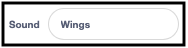

## दृश्य सेट करा

<div style="display: flex; flex-wrap: wrap">
<div style="flex-basis: 200px; flex-grow: 1; margin-right: 15px;">
तुम्ही दृश्य सेट कराल. तुमचा बॅकड्रॉप निवडा आणि ड्रॅगनफ्लाय जोडा जो स्टेज भोवती माऊस-पॉइंटर फॉलो करेल.
</div>
<div>
{:width="300px"}
</div>
</div>

--- task ---

[ड्रॅगनफ्लाय वाढवा स्टार्टर प्रोजेक्ट](https://scratch.mit.edu/projects/535695413/editor){:target="_blank"} उघडा. Scratch will open a blank project in a new browser tab.

--- /task ---

--- task ---

Click **Choose a Backdrop** and add a backdrop of your choice. आम्ही **Jurassic** बॅकड्रॉप वापरला.


--- /task ---

--- task ---

**Choose a Sprite** वर क्लिक करा आणि `dragonfly` शोधा, त्यानंतर**Dragonfly** sprite जोडा.


--- /task ---

--- task ---

**Dragonfly** sprite ने माऊस-पॉइंटर (किंवा तुमचे बोट) फॉलो करण्यासाठी स्क्रिप्ट जोडा:


```blocks3
when flag clicked
set size to [25] % // to start small
forever
point towards (mouse-pointer v)
move [5] steps
end
```
--- /task ---

--- task ---

**चाचणी:** हिरवा झेंडा क्लिक करा आणि **Dragonfly** sprite Stage च्या भोवती फिरू द्या. ड्रॅगनफ्लाय तुमच्या अपेक्षेप्रमाणे फिरत आहे का?

--- /task ---

ड्रॅगनफ्लायचा costume उजवीकडे तोंड करून नाही, त्यामुळे **Dragonfly** sprite चे डोके माऊस-पॉइंटरकडे जात नाही.

--- task ---

**Costumes** टॅबवर क्लिक करा आणि costume निवडण्यासाठी **Select** (arrow) टूल वापरा.

**Dragonfly** costume उजवीकडे करण्यासाठी निवडलेल्या costume च्या खाली असलेला **Rotate** टूल वापरा.


--- /task ---

--- task ---

**चाचणी:** हिरव्या झेंड्यावर क्लिक करा आणि ड्रॅगनफ्लाय आता कसा फिरतो ते बघा.

--- /task ---

ड्रॅगनफ्लाय व्हायब्रेट झाल्यावर फडफड आवाज करतात. तुमचा स्वतःचा साऊंड तयार करण्यासाठी तुम्ही Scratch मध्ये साऊंड एडिट करू शकता.

--- task ---

**Dragonfly** sprite ला **Crank** साऊंड जोडा.

[[[generic-scratch3-sound-from-library]]]


--- /task ---

--- task ---

**Play** बटनवर क्लिक करा जेणेकरून तुम्ही साऊंड आवाज ऐकू शकता.

--- /task ---

**Crank** साऊंड फार लांब आहे आणि ड्रॅगनफ्लायच्या पंखांसाठी फारच कमी आहे.

--- task ---

तुमचा कर्सर किंवा बोट वापरून साऊंडचा शेवट निवडा.

केवळ निवडलेल्या भागासह नवीन साऊंड तयार करण्यासाठी **Copy to New** वर क्लिक करा:


--- /task ---

--- task ---

**Crank2** ते `Wings` तुमच्या नवीन साऊंडला नवीन नाव द्या. 

--- /task ---

--- task ---

**Test:** Play the new sound. Click the **Faster** button a few times until you like the result:


--- /task ---

--- task ---

If you like, you can select the very end of the **Wings** sound, and then click **Delete** to remove it:


--- /task ---

--- task ---

Now add a block to play the **Wings** sound when the dragonfly moves:


```blocks3
when flag clicked
set size to [25] %
forever
+start sound [Wings v]
point towards (mouse-pointer v)
move [5] steps
end
```
--- /task ---

--- task ---

**Test:** Try out your dragonfly movement and sound effect.

--- /task ---

--- save ---
