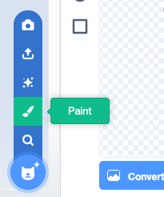

## खाण्यासाठी एक माशी

<div style="display: flex; flex-wrap: wrap">
<div style="flex-basis: 200px; flex-grow: 1; margin-right: 15px;">
ड्रॅगनफ्लायला खाण्यासाठी तुम्ही एक कीटक जोडाल. 
</div>
<div>
{:width="300px"}
</div>
</div>

<p style="border-left: solid; border-width:10px; border-color: #0faeb0; background-color: aliceblue; padding: 10px;">
गेम मध्ये स्वतःहून सभोवताली फिरणाऱ्या कॅरेक्टरला काहीवेळा <span style="color: #0faeb0">**mobs**</span> म्हणतात, मोबाईल्ससाठी शॉर्ट. mobs असलेल्या गेमचा तुम्ही विचार करू शकता का?</p>

**Frog 2** sprite मध्ये एक माशी आहे जीचा तुम्ही वापर करू शकता.

--- task ---

**Frog 2** sprite तुमच्या प्रोजेक्टला जोडा. sprite ला `Insect` असे रीनेम करा:


--- /task ---

तुम्हाला केवळ माशीची गरज आहे, बेडूकची नाही.

--- task ---

**Costumes** टॅबवर क्लिक करा. माशी निवडण्यासाठी तीच्यावर क्लिक करा आणि **copy** आयकॉनवर क्लिक करा.


--- /task ---

--- task ---

**Paint** पर्याय वापरून sprite ला नवीन costume जोडा:



--- /task ---

--- task ---

sprite नवीन costume मध्ये पेस्ट करण्यासाठी **Paste** आयकॉनवर क्लिक करा. माशीला **मध्यभागी** ड्रॅग करा ज्यामुळे ती क्रॉसहेअरसह ओळीत येईल.

तुम्ही तुमच्या कॉश्चुमला `Insect` असे रीनेम करू शकता आणि तुम्हाला नको असलेले इतर कॉश्चुम डिलीट करू शकता:


--- /task ---

--- task ---

माशीचा आकार वाढवा जेणेकरून ती पाहणे आणि पकडणे सोपे होईल:


--- /task ---

--- task ---

**Code** टॅबवर क्लिक करा आणि **Insect** sprite भोवताली उडण्यासाठी स्क्रिप्ट जोडा:


```blocks3
when flag clicked
forever
move [3] steps
if on edge, bounce
end
```

`if on edge, bounce`{:class="block3motion"} ब्लॉक स्प्राईट Stage च्या कडेला पोहोचला का ते तपासतो आणि स्प्राईट वेगवेगळ्या दिशेत असल्यास तो बघतो.

--- /task ---

तुम्हाला **Insect** sprite हा `hide`{:class="block3looks"} करायचा आहे `if`{:class="block3control"} तो **Dragonfly** sprite ने खाल्ला तर.

--- task ---

**Insect** sprite च्या मूवमेंट स्क्रिप्टला: `if`{:class="block3control"} ब्लॉक जोडा:


```blocks3
when flag clicked
forever
move [3] steps
if on edge, bounce
+if < > then 
end
```
--- /task ---

`if`{:class="block3control"} ला षटकोन-आकाराचे इनपुट आहे. याचा अर्थ असा की तुम्ही येथे **स्थिती** ठेवू शकता.

`if`{:class="block3control"} ब्लॉक रन झाल्यास, Scratch स्थिती तपासेल. स्थिती 'बरोबर' असेल `then`{:class="block3control"} `if`{:class="block3control"} ब्लॉकमधील कोड रन होईल.

तुम्हाला कीटक `hide`{:class="block3looks"} करायचा आहे `if`{:class="block3control"} तो `touching`{:class="block3sensing"} **Dragonfly** sprite ला करत असेल.

--- task ---

`touching [Dragonfly v]`{:class="block3sensing"} हा `if`{:class="block3control"} ब्लॉकमध्ये ड्रॅग करा. `hide`{:class="block3looks"} ब्लॉक `if`{:class="block3control"} ब्लॉकच्या आत जोडा.


```blocks3
when flag clicked
forever
move [3] steps
if on edge, bounce
+if <touching [Dragonfly v] ?> then // change from 'mouse-pointer'
+hide // eaten
end
```

--- /task ---

--- task ---

**चाचणी:** तुमचा कोड तपासा आणि ड्रॅगनफ्लायला माशीला खाण्यास नियंत्रीत करा. माशी नाहीशी झाली पाहिजे.

--- /task ---

ड्रॅगनफ्लाय जर फक्त एक माशी खाऊ शकत असेल तर ती फार मोठी होणार नाही!

--- task ---

Stage वर `go to a random position`{:class="block3motion"} ला ब्लॉक्स जोडा, आणि एक सेकंदासाठी तुमचा sprite `wait`{:class="block3control"} तयार करा त्यानंतर `show`{:class="block3looks"}:


```blocks3
when flag clicked
+show // show at the start
forever
move [3] steps
if on edge, bounce
if <touching [Dragonfly v] ?> then
hide
+go to (random position v)
+wait [1] seconds
+show // to look like a new fly
end
end
```

--- /task ---

--- task ---

**चाचणी:** आता तुमचा ड्रॅगनफ्लाय भरपूर माश्या खाऊ शकतो याची चाचणी करा.

सुरूवातीला दाखवण्यासाठी तुम्ही `show`{:class="block3looks"} ब्लॉक जोडला असल्याची खात्री करा.

--- /task ---

**टीप:** तुम्ही अधिक कोड जोडल्यावर तुम्हाला ड्रॅगनफ्लाय शांत असायला हवा असल्यास तुम्ही Stage च्या वरील लाल **Stop** बटनवर क्लिक करू शकता.

--- save ---
