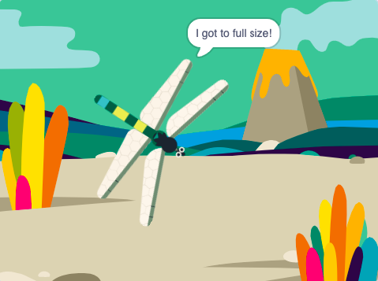

## पूर्ण आकारात वाढवा

<div style="display: flex; flex-wrap: wrap">
<div style="flex-basis: 200px; flex-grow: 1; margin-right: 15px;">
ड्रॅगनफ्लाय जेव्हा माशी खाईल तेव्हा तुम्ही वाढवाल आणि पूर्ण आकारात पोहोचल्यास थांबाल.
</div>
<div>
{:width="300px"}
</div>
</div>

<p style="border-left: solid; border-width:10px; border-color: #0faeb0; background-color: aliceblue; padding: 10px;">
सर्वात मोठे जिवंत ड्रॅगनफ्लाय मध्य अमेरिकेमध्ये आढळू शकतात आणि त्यांच्या पंखांचा आकार 19 सेमी असतो (तुमच्या हातापेक्षा थोडासा मोठा). सर्वात मोठी कीटक ज्याला ओळखले जात होते <span style="color: #0faeb0">**मेगान्युरोसीस पर्मियाना**</span>, तो 75 सेमी पंख असलेला ड्रॅगनफ्लाय आहे (मोठ्या पावलाचा आकार).</p>

माशीला तीला खाल्ले गेले आहे हे माहिती आहे, आणि आता ड्रॅगनफ्लायला ते माहिती असावे जेणेकरून तो वाढेल.

तुम्हाला दुसऱ्या स्प्राईटला काहीतरी घडले हे माहिती करून द्यायचे असल्यास, तुम्ही `broadcast`{:class="block3events"} ब्लॉक वापरू शकता जसेकी तुम्ही [Broadcasting spells](https://projects.raspberrypi.org/mr-IN/projects/broadcasting-spells){:target="_blank"} मध्ये केलेत.

--- task ---

`broadcast`{:class="block3events"} ब्लॉक **Insect** sprite मध्ये जोडा`food`{:class="block3events"} या मेसेजसह:


```blocks3
when flag clicked
show // सुरुवातीला दाखवा
forever
move [3] steps
if on edge, bounce
if <touching [Dragonfly v] ?> then
+broadcast [food v]
hide
go to (random position v)
wait [1] seconds
show
end
end
```
--- /task ---

**Dragonfly** sprite वाढायला हवा जेव्हा त्याला`food`{:class="block3events"} मेसेज मिळतो.

--- task ---

**Dragonfly** sprite निवडा आणि या स्क्रिप्टला जोडा:


```blocks3 
when I receive [food v]
change size by [5]
```

--- /task ---

--- task ---

ड्रॅगनफ्लायला **Chomp** साऊंड जोडा आणि कीटक खाल्ला गेल्यावर `start`{:class="block3sound"} करा:


```blocks3 
when I receive [food v]
+start sound [Chomp v]
change size by [5]
```
--- /task ---

--- task ---

**चाचणी:** ड्रॅगनफ्लाय वाढतो आणि त्याने माशी खाल्ल्यावर तो chomp साऊंड करतो याची चाचणी करण्यासाठी तुमचा प्रोजेक्ट रन करा.

--- /task ---

ड्रॅगनफ्लाय जेव्हा पूर्ण आकारात पोहोचेल, गेम तुमचे अभिनंदन करेल आणि थांबेल.

--- task ---

`if`{:class="block3control"} ब्लॉक जोडा.

ड्रॅनगफ्लाय पूर्ण आकारात जातो जेव्हा `size`{:class="block3looks"} `=`{:class="block3operators"} `100%`. प्रथम, षटकोन-आकाराच्या इनपुटमध्ये `=`{:class="block3operators"} ऑपरेटर जोडा:


```blocks3
when I receive [food v]
start sound [Chomp v]
change size by [5]
+if <[ ] = [ ]> then
end
```
--- /task ---

--- task ---

बिल्ट-इन `size`{:class="block3looks"} व्हेरिएबल जोडून आणि व्हॅल्यू `100` टाई करून स्थिती तयार करणे पूर्ण करा:


```blocks3
when I receive [food v]
start sound [Chomp v]
change size by [5]
+if <(size) = [100]> then
end
```
--- /task ---

--- task ---

ब्लॉक्स जोडा जेणेकरून `if`{:class="block3control"} स्थिती बरोबर असेल `then`{:class="block3control"} ड्रॅगनफ्लाय `broadcast`{:class="block3events"} करेल 'end' मेसेज आणि `say`{:class="block3looks"} `मला पूर्ण आकार मिळाला!`

शेवटी, `stop all`{:class="block3control"} ब्लॉक जोडा इतर ड्रॅगनफ्लाय स्क्रिप्ट थांबविण्यासाठी:


```blocks3
when I receive [food v]
start sound [Chomp v]
change size by [5]
if <(size) = [100]> then
+broadcast [end v]
+say [I got to full size!]
+stop [other scripts in sprite v] // 'all' मधून बदला
end
```
--- /task ---

--- task ---

या क्षणी, प्रोजेक्ट संपल्यानंतरही माशी फिरते. **Insect** sprite ला ही स्क्रिप्ट जोडा.


```blocks3
when I receive [end v]
stop [other scripts in sprite v]
```

--- /task ---

--- task ---

**चाचणी:** हिरव्या झेंड्यावर क्लिक करा आणि ड्रॅगनफ्लाय पूर्ण-आकारात पोहोचेपर्यंत माशा खाणे चालू ठेवा.

--- /task ---

--- save ---
