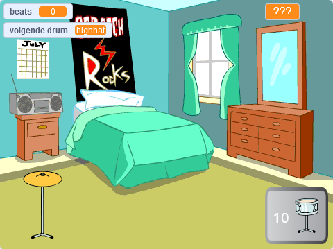

## Wat kun je verder nog doen?

Als je het [Meer scratch](https://projects.raspberrypi.org/nl-NL/raspberrypi/more-scratch)-pad volgt, kun je doorgaan naar het [Sterdrummer](https://projects.raspberrypi.org/nl-NL/projects/drum-star)-project. In dit project maak je een klikspel waarin je beats verdient om nieuwe drums te spelen op grotere podia.

--- print-only ---

--- /print-only ---

--- no-print ---

  <iframe allowtransparency="true" width="485" height="402" src="https://scratch.mit.edu/projects/embed/522323676/?autostart=false" frameborder="0"></iframe>

--- /no-print ---

Wil je nog meer plezier hebben met het het verkennen van Scratch, dan kun je een van [deze projecten](https://projects.raspberrypi.org/nl-NL/projects?software%5B%5D=scratch&curriculum%5B%5D=%201) proberen.

***
Dit project werd vertaald door vrijwilligers:

Cor Groot
Robert-Jan Kempenaar

Dankzij vrijwilligers kunnen we mensen over de hele wereld de kans geven om in hun eigen taal te leren. Jij kunt ons helpen meer mensen te bereiken door vrijwillig te starten met vertalen - meer informatie op [rpf.io/translate](https://rpf.io/translate).
