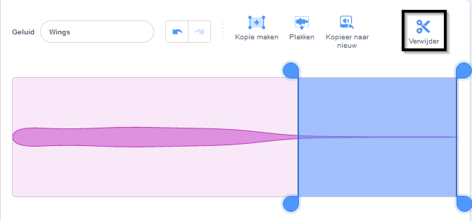

## Maak het speelveld

<div style="display: flex; flex-wrap: wrap">
<div style="flex-basis: 200px; flex-grow: 1; margin-right: 15px;">
Jij gaat het speelveld bepalen. Kies je achtergrond en voeg een libel toe die de muisaanwijzer binnen het speelveld volgt.
</div>
<div>
{:width="300px"}
</div>
</div>

--- task ---

Open het [Laat een libel groeien start-project](https://scratch.mit.edu/projects/535695413/editor){:target="_blank"}. Scratch wordt in een nieuw browsertabblad geopend.

--- /task ---

--- task ---

We gebruikten de **Jurassic** achtergrond. We gebruikten de **Jurassic** achtergrond.


--- /task ---

--- task ---

Klik op **Kies een sprite** en zoek naar `dragonfly` (libel) en voeg vervolgens de **dragonfly** sprite toe.


--- /task ---

--- task ---

Voeg een script toe om de sprite **Dragonfly** de muisaanwijzer (of je vinger) te laten volgen:


```blocks3
when flag clicked
set size to [25] % // to start small
forever
point towards (mouse-pointer v)
move [5] steps
end
```
--- /task ---

--- task ---

**Test:** Klik op de groene vlag en laat de sprite **Dragonfly** over het speelveld bewegen. Beweegt de libel zoals je zou verwachten?

--- /task ---

Het Dragonfly-uiterlijk is niet naar rechts gericht, dus het hoofd van de **Dragonfly**-sprite wijst niet naar de muisaanwijzer.

--- task ---

Klik op het tabblad **Uiterlijken** en gebruik het gereedschap **Selecteren** (pijl) om het uiterlijk te selecteren.

Gebruik het gereedschap **Roteren** onderaan het geselecteerde kostuum om het **Dragonfly**-uiterlijk naar rechts te draaien.


--- /task ---

--- task ---

**Test:** Klik op de groene vlag en kijk hoe de libel nu beweegt.

--- /task ---

De vleugels van libellen maken een fladderend geluid terwijl ze vliegen. Je kan een geluid in Scratch bewerken om je eigen geluid te creëren.

--- task ---

Voeg het **Crank**-geluid toe aan de **Dragonfly**-sprite.

[[[generic-scratch3-sound-from-library]]]


--- /task ---

--- task ---

Klik op de **afspeel** knop zodat je het geluid kan horen.

--- /task ---

Het **Crank**-geluid is te lang en te langzaam voor libellenvleugels.

--- task ---

Selecteer het einde van het geluid met je cursor of vinger.

Klik op **Kopieer naar nieuw** om een nieuw geluid te maken met alleen het geselecteerde gedeelte:


--- /task ---

--- task ---

Hernoem je nieuwe geluid van **Crank2** naar `Vleugels`. 

--- /task ---

--- task ---

Speel het nieuwe geluid af. Klik een paar keer op de knop **Sneller** totdat het resultaat je bevalt:


--- /task ---

--- task ---

Als je wilt, kun je het einde van het **Vleugels**-geluid selecteren en vervolgens op **verwijder** klikken om het te verwijderen:



--- /task ---

--- task ---

Voeg nu een blok toe om het **Vleugels**-geluid te spelen wanneer de libel beweegt:


```blocks3
when flag clicked
set size to [25] %
forever
+start sound [Wings v]
point towards (mouse-pointer v)
move [5] steps
end
```
--- /task ---

--- task ---

**Test:** Probeer je libelbeweging en geluidseffect uit.

--- /task ---

--- save ---
