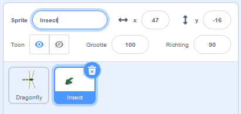
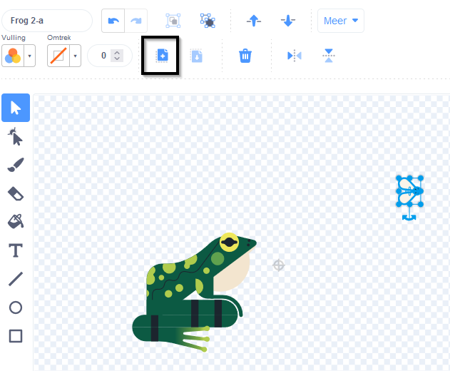
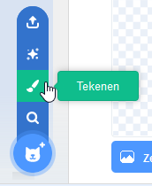
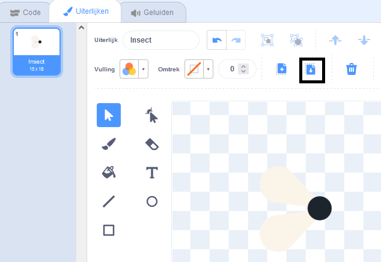
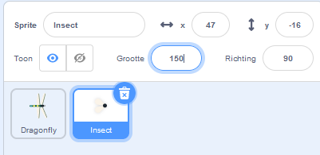

## Een vlieg om te eten

<div style="display: flex; flex-wrap: wrap">
<div style="flex-basis: 200px; flex-grow: 1; margin-right: 15px;">
Je voegt een insect toe voor de libel om te eten. 
</div>
<div>
{:width="300px"}
</div>
</div>

<p style="border-left: solid; border-width:10px; border-color: #0faeb0; background-color: aliceblue; padding: 10px;">
Personages die in games alleen rondlopen, worden soms <span style="color: #0faeb0">**mobs**</span> genoemd, een afkorting voor mobieltjes. Kun je een spel bedenken met mobs?</p>

Er zit een vlieg in de **Frog 2** sprite die je kunt gebruiken.

--- task ---

Voeg de **Frog 2** sprite toe aan je project. Hernoem de sprite naar `Insect`:




--- /task ---

Je hebt alleen de vlieg nodig, niet de kikker.

--- task ---

Klik op het tabblad **Uiterlijken**. Klik op de vlieg om het te selecteren en klik op het **Kopie maken**-pictogram.



--- /task ---

--- task ---

Voeg een nieuw uiterlijk toe aan de sprite met behulp van de **Teken**-optie:



--- /task ---

--- task ---

Klik op het pictogram **Plakken** om de sprite in het nieuwe uiterlijk te plakken. Sleep de vlieg naar de **midden** zodat deze uitgelijnd is met het dradenkruis.

Je kunt je uiterlijk `Insect` hernoemen en de andere uiterlijken verwijderen, want die heb je niet nodig:



--- /task ---

--- task ---

Vergroot de vlieg zodat deze gemakkelijker te zien en te vangen is:



--- /task ---

--- task ---

Klik op het tabblad **Code** en voeg een script toe om de sprite **Insect** rond te laten stuiteren:


```blocks3
when flag clicked
forever
move [3] steps
if on edge, bounce
end
```

Het `keer om aan de rand`{:class="block3motion"}-blok controleert of de sprite de rand van het speelveld heeft bereikt en stuurt de sprite in een andere richting als dat het geval is.

--- /task ---

Je wilt dat het **Insect** sprite `verdwijnt`{:class="block3looks"} `als`{:class="block3control"} het wordt opgegeten door de **Dragonfly** sprite.

--- task ---

Voeg een `als`{:class="block3control"} blok toe aan het bewegingsscript van de **Insect** sprite:


```blocks3
when flag clicked
forever
move [3] steps
if on edge, bounce
+if < > then 
end
```
--- /task ---

De `als`{:class="block3control"} heeft een zeshoekige invoer. Dit betekent dat je hier een **voorwaarde** in kunt plaatsen.

Wanneer het `als`{:class="block3control"}-blok wordt uitgevoerd, zal Scratch de voorwaarde controleren. Als de voorwaarde 'waar' is `dan`{:class="block3control"} wordt de code in het `als`{:class="block3control"}-blok uitgevoerd.

Je wilt dat het insect `verdwijnt`{:class="block3looks"} ` als`{:class="block3control"} het de **Dragonfly** sprite `aanraakt`{:class="block3sensing"}.

--- task ---

Sleep een `raak ik [Dragonfly v]`{:class="block3sensing"} in het `als`{:class="block3control"}-blok. Voeg een `verdwijn`{:class="block3looks"} blok toe binnen het `als`{:class="block3control"} blok.


```blocks3
when flag clicked
forever
move [3] steps
if on edge, bounce
+if <touching [Dragonfly v] ?> then // change from 'mouse-pointer'
+hide // eaten
end
```

--- /task ---

--- task ---

**Test:** Test je code en bestuur de libel om de vlieg op te eten. De vlieg zou moeten verdwijnen.

--- /task ---

De libel wordt niet erg groot als hij maar één vlieg kan eten!

--- task ---

Voeg een blok `ga naar een willekeurige positie`{:class="block3motion"} toe aan werkgebied, en laat je sprite `een seconde wachten`{:class="block3control"} en dan `verschijnen`{:class="block3looks "}:


```blocks3
when flag clicked
+show // show at the start
forever
move [3] steps
if on edge, bounce
if <touching [Dragonfly v] ?> then
hide
+go to (random position v)
+wait [1] seconds
+show // to look like a new fly
end
end
```

--- /task ---

--- task ---

**Test:** Test of je libel nu veel vliegen kan eten.

Zorg ervoor dat je het `verschijn`{:class="block3looks"} blok hebt toegevoegd om de sprite weer te geven aan het begin.

--- /task ---

**Tip:** Je kunt op de rode **Stop** knop boven het werkgebied klikken als je wilt dat de libel stil is terwijl je meer code toevoegt.

--- save ---
