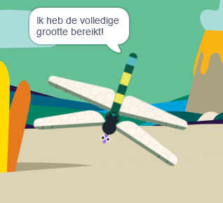

## Groei tot volledige grootte

<div style="display: flex; flex-wrap: wrap">
<div style="flex-basis: 200px; flex-grow: 1; margin-right: 15px;">
Je laat de libel groeien als hij een vlieg eet en stopt als hij zijn volledige grootte bereikt.
</div>
<div>
{:width="300px"}
</div>
</div>

The Dragonfly needs to grow when it eats a fly.

Als je een andere sprite moet laten weten dat er iets is gebeurd, kun je een `zend signaal`{:class="block3events"}-blok gebruiken zoals je deed in [Verzend spreuken](https://projects.raspberrypi.org/en/projects/broadcasting-spells){:target="_blank"}.

--- task ---

Voeg een `zend signaal`{:class="block3events"} blok toe aan de **Insect** sprite met nieuw bericht `eten`{:class="block3events"}:


```blocks3
when flag clicked
show // show at the start
forever
move [3] steps
if on edge, bounce
if <touching [Dragonfly v] ?> then
+broadcast [food v]
hide
go to (random position v)
wait [1] seconds
show
end
end
```
--- /task ---

De sprite **Dragonfly** moet groeien wanneer hij het bericht `eten`{:class="block3events"} ontvangt.

--- task ---

Selecteer de sprite **Dragonfly** en voeg dit script toe:


```blocks3 
when I receive [food v]
change size by [5]
```

--- /task ---

--- task ---

Voeg het **Chomp** -geluid toe aan de libel en `start`{:class="block3sound"} het wanneer een insect wordt opgegeten:

```blocks3 
when I receive [food v]
+start sound [Chomp v]
change size by [5]
```
--- /task ---

--- task ---

**Test:** Voer je project uit om te testen of de libel groeit en een kauwgeluid maakt als hij een vlieg eet.

--- /task ---

Wanneer de libel zijn volledige grootte bereikt, zal het spel je feliciteren en stoppen.

--- task ---

Voeg een `als`{:class="block3control"} blok toe.

```blocks3
when I receive [food v]
start sound [Chomp v]
change size by [5]
+if < > then
end
```

--- /task ---

De libel is op volledige grootte wanneer de `grootte`{:class="block3looks"} `=`{:class="block3operators"} `100%` is.

--- task ---

Voeg eerst een `=`{:class="block3operators"} functie toe aan de zeshoekige invoer:

```blocks3
when I receive [food v]
start sound [Chomp v]
change size by [5]
+if <[ ] = [ ]> then
end
```
--- /task ---

--- task ---

Voltooi het opbouwen van de voorwaarde door een ingebouwde `grootte`{:class="block3looks"} variabele toe te voegen en typ de waarde `100`:

```blocks3
when I receive [food v]
start sound [Chomp v]
change size by [5]
+if <(size) = [100]> then
end
```
--- /task ---

--- task ---

Voeg blokken toe zodat `als`{:class="block3control"} de voorwaarde waar is `dan`{:class="block3control"} `zend`{:class="block3events"} de libel een 'Einde'-bericht en `zeg`{:class="block3looks"} `Ik heb de volledige grootte bereikt!`

Voeg ten slotte een `stop alle`{:class="block3control"} blok toe om de andere libel-scripts te stoppen:

```blocks3
when I receive [food v]
start sound [Chomp v]
change size by [5]
if <(size) = [100]> then
+broadcast [end v]
+say [I got to full size!]
+stop [other scripts in sprite v] // change from 'all'
end
```
--- /task ---

--- task ---

Op dit moment beweegt de vlieg nog steeds nadat het project is afgelopen. Voeg dit script toe aan de sprite **Insect**.


```blocks3
when I receive [end v]
stop [other scripts in sprite v]
```

--- /task ---

--- task ---

**Test:** Klik op de groene vlag en blijf vliegen eten totdat je libel de volledige grootte heeft bereikt.

--- /task ---

--- save ---
