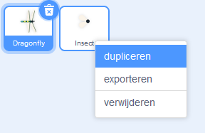
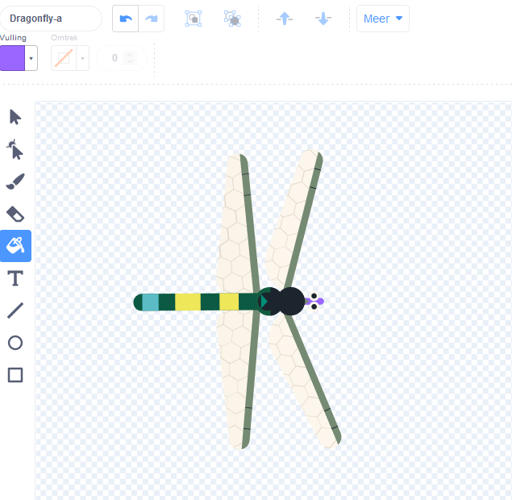
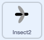
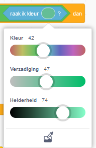

## Meer eten

<div style="display: flex; flex-wrap: wrap">
<div style="flex-basis: 200px; flex-grow: 1; margin-right: 15px;">
Geef de libel een keuze aan insecten.
</div>
<div>
{:width="300px"}
</div>
</div>

--- task ---

Klik met de rechtermuisknop op de sprite **Insect** in de lijst Sprite onder het werkgebied en **dupliceer** deze.



--- /task ---

Het is handig als dit insect er anders uitziet dan de vlieg.

--- task ---

Klik op het tabblad **Uiterlijken**.

**Kies:** Maak een ander vliegend insect.
+ Je kunt het **Vulling** gereedschap gebruiken om de kleur van het insect te veranderen
+ **Schilder** je eigen insectenuiterlijk
+ **Voeg** een ander insectsprite van Scratch toe

--- /task ---

Het insect wordt zelfs opgegeten als het de vleugel of staart van de libel raakt.

Om je app realistischer te maken, corrigeer je dit zodat het insect wordt opgegeten door de mond van de libel. Je kunt het `raak ik kleur`{:class="block3sensing"} blok gebruiken, zodat het insect alleen wordt opgegeten als het een bepaalde kleur aanraakt van de **libel**.

--- task ---

Selecteer de **Dragonfly** sprite en klik op het tabblad **Uiterlijken**.

Gebruik het vulgereedschap om de mond van de **libel** in te kleuren. We gebruikten paars:



--- /task ---

Je moet controleren of de **Insect2** sprite de **libel** sprite `en`{:class="block3operators"} de kleur van de mond van de libel raakt.

--- task ---

Selecteer de **Insect2** sprite en klik op het tabblad **Code**.

Sleep een `en`{:class="block3operators"} blok in het `if`{:class="block3control"} blok.

Het `<touching [Dragonfly v] ?>`{:class="block3sensing"} blok komt tevoorschijn, sleep het naar de linkerkant van het `en`{:class="block3operators"} blok:



```blocks3
when flag clicked
show
forever
move [3] steps 
if on edge, bounce
+if <<touching [Dragonfly v] ?> and <>> then
broadcast [eten v]
hide
go to (random position v)
show
end
end
```

--- /task ---

--- task ---

Sleep een `raak ik kleur`{:class="block3sensing"} blok naar de rechterkant van het `en`{:class="block3operators"} blok:


```blocks3
when flag clicked
show
forever
move [3] steps
if on edge, bounce
+if <<touching [Dragonfly v] ?> and <touching color (#9966ff) ?>> then
broadcast [eten v]
hide
go to (random position v)
show
end
end
```

Als de kleur van de mond van de libel niet is geselecteerd, klik dan op de kleurencirkel en klik vervolgens op het **Pipet** gereedschap om een kleur te selecteren.



Klik op de mond van de libel in het toneel om de bijpassende kleur in te stellen:


**Tip:** Als dit lastig is om te doen, verander dan de grootte van de sprite **Dragonfly**, zodat hij erg groot is.

--- /task ---

--- task ---

**Test:** Test nu of de libel het tweede insect alleen met zijn mond kan eten.

Als je wilt, kun je de eerste **Insect** veranderen, zodat deze alleen met de mond van de libel kan worden gegeten.

--- /task ---

--- save ---

