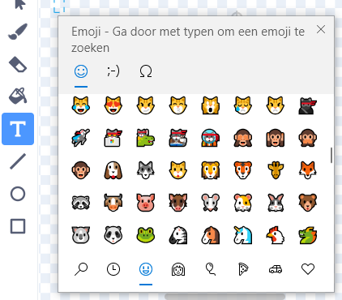
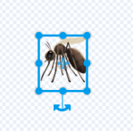

## Verbeter je project

Probeer in deze stap meer insecten toe te voegen en verander de manier waarop jouw project eruitziet en zich gedraagt.

{:width="300px"}

### Voeg meer insecten toe

Voeg meer insecten toe. Je moet ze misschien sneller laten bewegen, zodat ze moeilijker te vangen zijn voor de libel.

Je kunt je eigen insecten schilderen of proberen een emoji-mug toe te voegen!

--- task ---

Gebruik het emoji-toetsenbord om een **Mosquito emoji** sprite toe te voegen.

Dupliceer een bestaande **insecten** sprite en klik vervolgens op het tabblad **Uiterlijken**. **Schilder** een nieuw uiterlijk en selecteer het gereedschap **Tekst**. Gebruik in plaats van tekst te typen de emoji-sneltoets van je besturingssysteem:

Windows - Windows-toets + '.' MacOS - ctrl + cmd + spatie Linux - ctrl + '.'

Selecteer de **Mosquito** emoji om deze in de Paint-editor in te voegen. Gebruik het gereedschap **Selecteren** (pijl) om je mug te centreren, vergroten of verkleinen en roteren totdat je er tevreden mee bent.

**Tip:** Emoji's kunnen er op verschillende computers anders uitzien, dus ze zien er mogelijk niet hetzelfde uit op een tablet en een desktopcomputer. Sommige emoji's zijn niet beschikbaar op sommige computers, maar de meeste moderne computers zullen ze wel ondersteunen.

--- /task ---

--- task ---

Gebruik je rugzak om insecten te ruilen met je vrienden uit hun 'Laat een libel groeien'-projecten.

[[[scratch-backpack]]]

--- /task ---

--- task ---

**Tip:** Controleer of al je sprites en uiterlijken zinnige namen hebben. Het maakt jouw project gemakkelijker te begrijpen als je er later op terugkomt.

**Tip:** Zorg ervoor dat je code netjes is opgemaakt in het gebied Code. Klik met de rechtermuisknop op het codegebied en kies **Blokken opruimen** om Scratch je code te laten opschonen.

--- /task ---

--- collapse ---
---
title: Voltooid project
---

Je kunt het [voltooide project hier](https://scratch.mit.edu/projects/521688740/){:target="_blank"} bekijken.

--- /collapse ---

--- save ---
