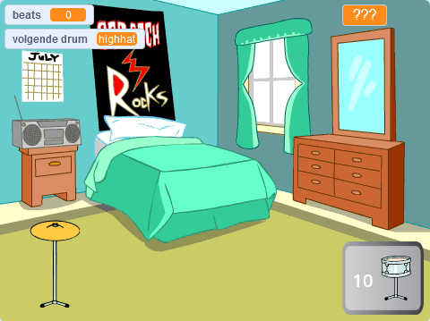

## Wat kun je verder nog doen?

Als je het [Meer Scratch](https://projects.raspberrypi.org/nl-NL/raspberrypi/more-scratch)-traject volgt, kun je verdergaan met het [Drum ster](https://projects.raspberrypi.org/nl-NL/projects/drum-star)-project. In dit project maak je een clickergame waarin je beats verdient om op nieuwe drums te spelen in grotere zalen.

--- print-only ---

--- /print-only ---

--- no-print ---

  <iframe allowtransparency="true" width="485" height="402" src="https://scratch.mit.edu/projects/embed/707231411/?autostart=false" frameborder="0"></iframe>

--- /no-print ---

Als je meer plezier wilt hebben bij het verkennen van Scratch, dan kun je een van [deze projecten](https://projects.raspberrypi.org/nl-NL/projects?software%5B%5D=scratch&curriculum%5B%5D=%201) uitproberen.

***

Dit project werd vertaald door vrijwilligers:

Cor Groot
Robert-Jan Kempenaar
Iny van Beuningen

Dankzij vrijwilligers kunnen we mensen over de hele wereld de kans geven om in hun eigen taal te leren. Jij kunt ons helpen meer mensen te bereiken door vrijwillig te starten met vertalen - meer informatie op [rpf.io/translate](https://rpf.io/translate).