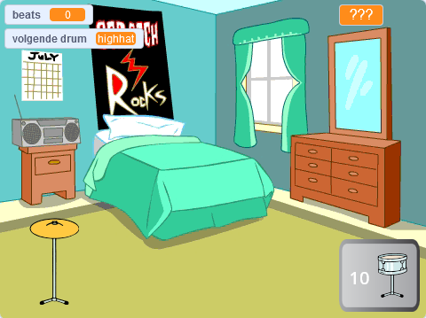

## Wat kun je verder nog doen?

Als je het [Meer Scratch](https://projects.raspberrypi.org/en/raspberrypi/more-scratch) -traject volgt, kun je verdergaan met het [Drum ster](https://projects.raspberrypi.org/en/projects/drum-star) -project. In dit project maak je een clickergame waarin je beats verdient om op nieuwe drums te spelen in grotere zalen.

--- print-only ---

--- /print-only ---

--- no-print ---

  <iframe allowtransparency="true" width="485" height="402" src="https://scratch.mit.edu/projects/embed/522323676/?autostart=false" frameborder="0"></iframe>

--- /no-print ---

Als je meer plezier wilt hebben bij het verkennen van Scratch, dan kun je een van [deze projecten](https://projects.raspberrypi.org/en/projects?software%5B%5D=scratch&curriculum%5B%5D=%201) uitproberen.
