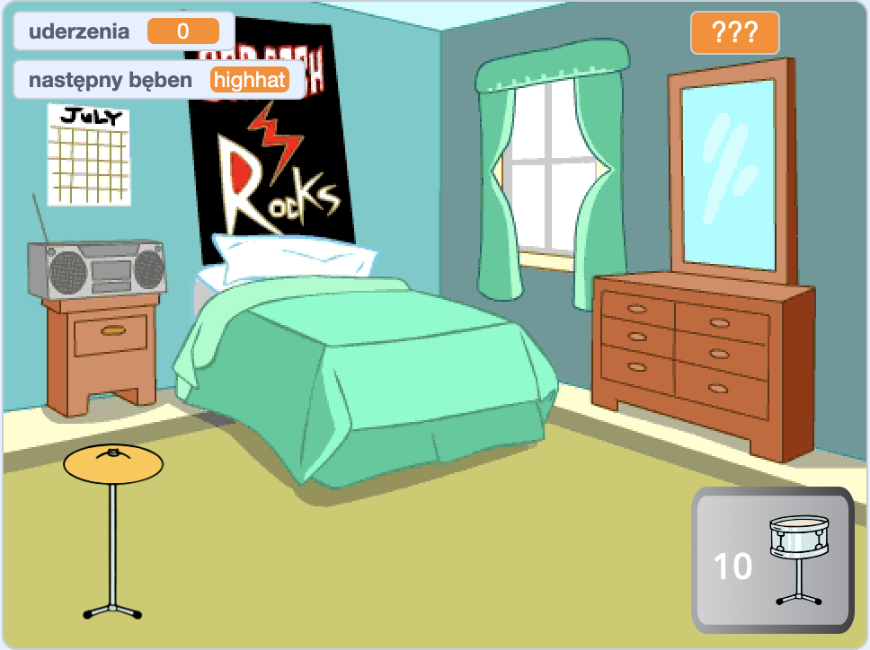

## Co dalej?

Jeśli podążasz ścieżką [Więcej projektów w Scratch](https://projects.raspberrypi.org/en/raspberrypi/more-scratch), możesz przejść do projektu [Gwiazda perkusji](https://projects.raspberrypi.org/en/projects/drum-star). W tym projekcie stworzysz grę typu "kliker", w której będziesz zdobywać rytmy, aby grać na nowych bębnach w większych salach.

--- print-only ---

--- /print-only ---

--- no-print ---

  <iframe allowtransparency="true" width="485" height="402" src="https://scratch.mit.edu/projects/embed/522323676/?autostart=false" frameborder="0"></iframe>

--- /no-print ---

Jeśli chcesz mieć więcej zabawy podczas odkrywania Scratch, możesz wypróbować dowolny z [tych projektów](https://projects.raspberrypi.org/en/projects?software%5B%5D=scratch&curriculum%5B%5D=%201).
