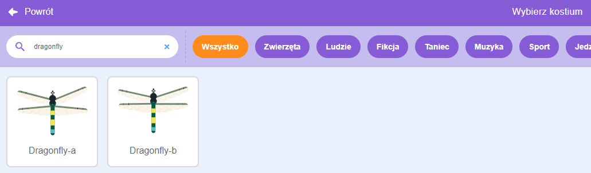
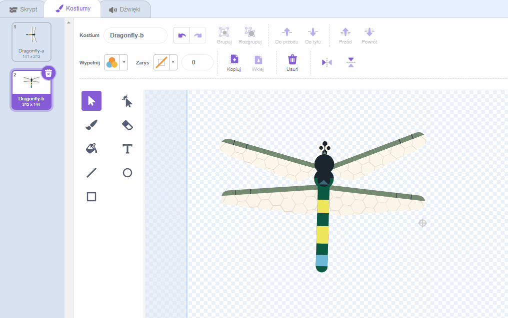
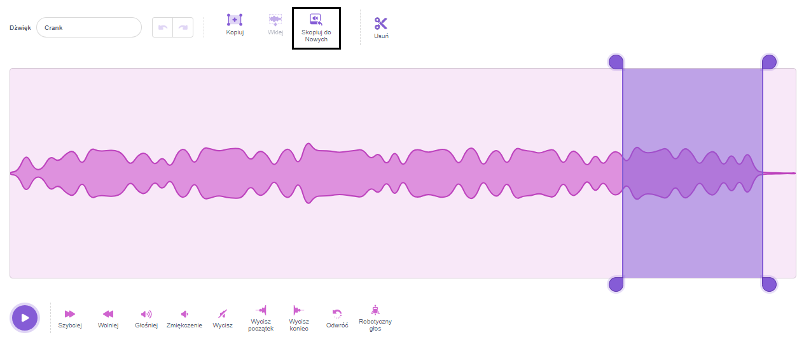
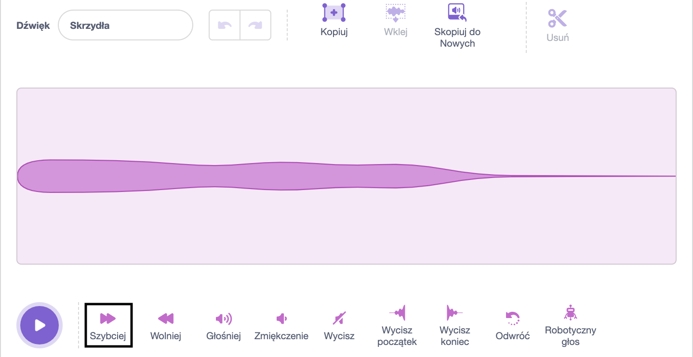
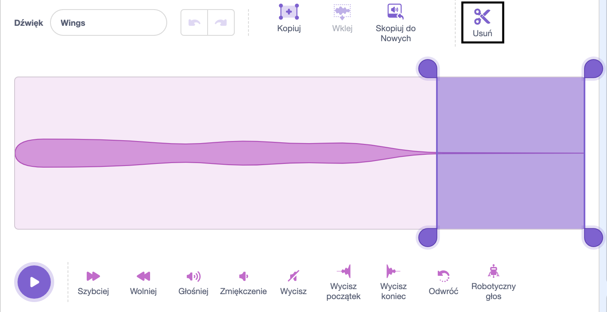

## Ustawić scenę

<div style="display: flex; flex-wrap: wrap">
<div style="flex-basis: 200px; flex-grow: 1; margin-right: 15px;">
Ustawisz scenę. Wybierz tło i dodaj ważkę, która podąża za wskaźnikiem myszy na scenie.
</div>
<div>
{:width="300px"}
</div>
</div>

--- task ---

Otwórz [projekt startowy Wyhoduj ważkę ](https://scratch.mit.edu/projects/535695413/editor){:target="_blank"}. Scratch will open a blank project in a new browser tab.

--- /task ---

--- task ---

Click **Choose a Backdrop** and add a backdrop of your choice. Użyliśmy tła **Jurassic**.


--- /task ---

--- task ---

Kliknij **Wybierz duszka** i wyszukaj `dragonfly`, a następnie dodaj duszka **ważka**.




--- /task ---

--- task ---

Dodaj skrypt, aby duszek **ważka** podążał za wskaźnikiem myszy (lub palcem):


```blocks3
when flag clicked
set size to [25] % // to start small
forever
point towards (mouse-pointer v)
move [5] steps
end
```
--- /task ---

--- task ---

**Test:** Kliknij zieloną flagę i spraw, aby duszek **ważka** poruszał się po scenie. Czy ważka porusza się tak, jak można by się spodziewać?

--- /task ---

Kostium ważki nie jest skierowany w prawo, więc głowa duszka **ważka** nie jest skierowana w stronę wskaźnika myszy.

--- task ---

Kliknij zakładkę **Kostiumy** i użyj narzędzia **Wybierz** (strzałka), aby wybrać kostium.

Użyj narzędzia **Obróć** na dole wybranego kostiumu, aby obrócić kostium **ważka** w prawo.



--- /task ---

--- task ---

**Test:** Kliknij zieloną flagę i zobacz, jak teraz porusza się ważka.

--- /task ---

Skrzydła ważki wydają dźwięk trzepotania ponieważ wibrują. Możesz edytować dźwięk w Scratch, aby stworzyć własny dźwięk.

--- task ---

Dodaj dźwięk **Crank** do duszka **ważki**.

[[[generic-scratch3-sound-from-library]]]


--- /task ---

--- task ---

**Test:** Click the **Play** button so you can hear the sound.

--- /task ---

Dźwięk **Crank** jest zbyt długi i zbyt wolny dla skrzydeł ważki.

--- task ---

Wybierz koniec dźwięku za pomocą kursora lub palca.

Kliknij **Skopiuj do nowych**, aby stworzyć nowy dźwięk tylko z wybraną częścią:



--- /task ---

--- task ---

Zmień nazwę swojego nowego dźwięku z **Crank2** na `Skrzydła`. 

--- /task ---

--- task ---

**Test:** Play the new sound. Click the **Faster** button a few times until you like the result:



--- /task ---

--- task ---

If you like, you can select the very end of the **Wings** sound, and then click **Delete** to remove it:



--- /task ---

--- task ---

Now add a block to play the **Wings** sound when the dragonfly moves:


```blocks3
when flag clicked
set size to [25] %
forever
+start sound [Wings v]
point towards (mouse-pointer v)
move [5] steps
end
```
--- /task ---

--- task ---

**Test:** Try out your dragonfly movement and sound effect.

--- /task ---

--- save ---
