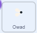

## Mucha do jedzenia

<div style="display: flex; flex-wrap: wrap">
<div style="flex-basis: 200px; flex-grow: 1; margin-right: 15px;">
Dodasz owada, do zjedzenia przez ważkę. 
</div>
<div>
{:width="300px"}
</div>
</div>

<p style="border-left: solid; border-width:10px; border-color: #0faeb0; background-color: aliceblue; padding: 10px;">
Postacie, które poruszają się samodzielnie w grach, są czasami nazywane <span style="color: #0faeb0">**mobami**</span>, skrótem od mobilne. Czy możesz pomyśleć o grze, która ma moby?</p>

W duszku **Frog 2** jest mucha, której możesz użyć.

--- task ---

Dodaj duszka **Frog 2** do swojego projektu. Zmień nazwę duszka na `Owad`:


--- /task ---

Potrzebujesz tylko muchy, nie żaby.

--- task ---

Naciśnij na zakładkę **Kostiumy**. Kliknij muchę, aby ją wybrać i kliknij ikonę **Kopiuj**.


--- /task ---

--- task ---

Dodaj nowy kostium do duszka za pomocą opcji **Maluj**:


--- /task ---

--- task ---

Kliknij ikonę **Wklej**, aby wkleić duszka do nowego kostiumu. Przeciągnij muchę **do środka**, aby zrównała się z celownikiem.

Możesz zmienić nazwę swojego kostiumu `Owada` i usunąć inne kostiumy, ponieważ nie będą Tobie potrzebne:


--- /task ---

--- task ---

Zwiększ rozmiar muchy, aby łatwiej było ją zobaczyć i złapać:


--- /task ---

--- task ---

Kliknij zakładkę **Skrypt** i dodaj skrypt, który sprawi, że duszek **Owad** będzie się odbijał:



```blocks3
when flag clicked
forever
move [3] steps
if on edge, bounce
end
```

Blok `jeśli na brzegu, odbij się`{:class="block3motion"} sprawdza, czy duszek osiągnął krawędź sceny i wskazuje inny kierunek, jeśli tak się stało.

--- /task ---

Chcesz, aby duszek **Owad** się `ukrył`{:class="block3looks"} `jeśli`{:class="block3control"} zostanie zjedzony przez duszka **Ważka**.

--- task ---

Dodaj blok `jeżeli`{:class="block3control"} do skryptu odpowiadającego za ruchu duszka **Owad**:


```blocks3
when flag clicked
forever
move [3] steps
if on edge, bounce
+if < > then 
end
```
--- /task ---

`Jeżeli`{:class="block3control"} ma wejście w kształcie sześciokąta. Oznacza to, że możesz umieścić w nim **warunek**.

Gdy zostanie uruchomiony blok `jeżeli`{:class="block3control"}, Scratch sprawdzi warunek. Jeśli warunek jest spełniowy(wartość "prawda") `wtedy`{:class="block3control"} zostanie uruchomiony kod wewnątrz bloku `jeżeli`{:class="block3control"}.

Chcesz, żeby owad się `ukrył`{:class="block3looks"} `jeśli`{:class="block3control"} `dotyka`{:class="block3sensing"} duszka **Ważka**.

--- task ---

Przeciągnij `dotyka [Ważka v]`{:class="block3sensing"} do bloku `jeżeli`{:class="block3control"}. Dodaj blok `ukryj`{:class="block3looks"} wewnątrz bloku `jeżeli`{:class="block3control"}.


```blocks3
when flag clicked
forever
move [3] steps
if on edge, bounce
+if <touching [Dragonfly v] ?> then // change from 'mouse-pointer'
+hide // eaten
end
```

--- /task ---

--- task ---

**Test:** Przetestuj swój kod i kontroluj ważkę, aby zjeść muchę. Mucha powinna zniknąć.

--- /task ---

Ważka nie stanie się zbyt duża, jeśli zje tylko jedną muchę!

--- task ---

Dodaj bloki do `idź do losowej pozycji`{:class="block3motion"} na scenie i spraw, aby twój duszek `czekał`{:class="block3control"} przez jedną sekundę, a następnie się `pokazał`{:class="block3looks"}:


```blocks3
when flag clicked
+show // show at the start
forever
move [3] steps
if on edge, bounce
if <touching [Dragonfly v] ?> then
hide
+go to (random position v)
+wait [1] seconds
+show // to look like a new fly
end
end
```

--- /task ---

--- task ---

**Test:** Sprawdź, czy twoja ważka może teraz jeść dużo much.

Upewnij się, że dodałeś blok `pokaż`{:class="block3looks"}, aby był wyświetlany na początku.

--- /task ---

**Wskazówka:** Możesz kliknąć czerwony przycisk **Zatrzymaj** nad sceną, jeśli chcesz, aby ważka była cicha podczas dodawania kodu.

--- save ---
