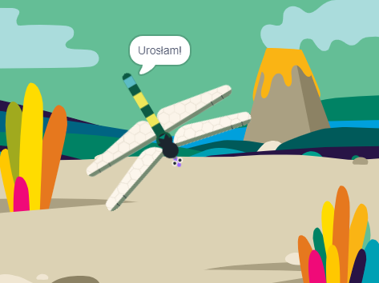

## Rośnij aż do maksymalnego rozmiaru

<div style="display: flex; flex-wrap: wrap">
<div style="flex-basis: 200px; flex-grow: 1; margin-right: 15px;">
Sprawisz, że ważka urośnie, gdy zje muchę, i przestanie rosnąć, gdy osiągnie maksymalny rozmiar.
</div>
<div>
{:width="300px"}
</div>
</div>

The Dragonfly needs to grow when it eats a fly.

Kiedy musisz powiadomić innego duszka, że coś się wydarzyło, możesz użyć bloku`nadaj komunikat`{:class="block3events"}, tak jak w przypadku [nadawania czarów](https://projects.raspberrypi.org/en/projects/broadcasting-spells){:target="_blank"}.

--- task ---

Dodaj blok `nadaj komunikat`{:class="block3events"} do duszka **Owad** z nową wiadomością `pokarm`{:class="block3events"}:


```blocks3
when flag clicked
show // show at the start
forever
move [3] steps
if on edge, bounce
if <touching [Dragonfly v] ?> then
+broadcast [food v]
hide
go to (random position v)
wait [1] seconds
show
end
end
```
--- /task ---

Duszek **Ważka** musi urosnąć, gdy otrzyma wiadomość `pokarm`{:class="block3events"}.

--- task ---

Wybierz duszka **ważka** i dodaj ten fragment kodu:


```blocks3 
when I receive [food v]
change size by [5]
```

--- /task ---

--- task ---

Dodaj dźwięk **Chomp** do ważki i `zagraj `{:class="block3sound"} go, gdy owad zostanie zjedzony:

```blocks3 
when I receive [food v]
+start sound [Chomp v]
change size by [5]
```
--- /task ---

--- task ---

**Test:** Uruchom swój projekt, aby przetestować, jak ważka rośnie i wydaje dźwięk chrupania, gdy zjada muchę.

--- /task ---

Kiedy ważka osiągnie pełny rozmiar, gra pogratuluje ci i zatrzyma się.

--- task ---

Dodaj blok `jeżeli`{:class="block3control"}.

```blocks3
when I receive [food v]
start sound [Chomp v]
change size by [5]
+if < > then
end
```

--- /task ---

Ważka jest w maksymalnie wyrośnięta, gdy `rozmiar `{:class="block3looks"} `=`{:class="block3operators"} `100%`.

--- task ---

First, add an `=`{:class="block3operators"} operator into the hexagon-shaped input:

```blocks3
when I receive [food v]
start sound [Chomp v]
change size by [5]
+if <[ ] = [ ]> then
end
```
--- /task ---

--- task ---

Zakończ tworzenie warunków dodając wbudowaną zmienną `rozmiar`{:class="block3looks"} i wpisz wartość `100`:

```blocks3
when I receive [food v]
start sound [Chomp v]
change size by [5]
+if <(size) = [100]> then
end
```
--- /task ---

--- task ---

Dodaj bloki tak, że kiedy warunek `jeżeli`{:class="block3control"} jest prawdziwy `to`{:class="block3control"} ważka `nada`{:class="block3events"} komunikat 'koniec' i `powiedz`{:class="block3looks"} `Osiągnęłam maksymalny rozmiar!`

Na koniec dodaj blok `zatrzymaj wszystko`{:class="block3control"}, aby zatrzymać inne skrypty ważki:

```blocks3
when I receive [food v]
start sound [Chomp v]
change size by [5]
if <(size) = [100]> then
+broadcast [end v]
+say [I got to full size!]
+stop [other scripts in sprite v] // change from 'all'
end
```
--- /task ---

--- task ---

W tej chwili mucha nadal się porusza po zakończeniu projektu. Dodaj ten skrypt do duszka **Owad**.


```blocks3
when I receive [end v]
stop [other scripts in sprite v]
```

--- /task ---

--- task ---

**Test:** Kliknij zieloną flagę i dalej jedz muchy, aż twoja ważka osiągnie maksymalny rozmiar.

--- /task ---

--- save ---
