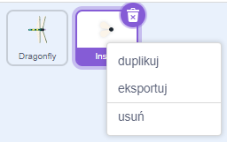
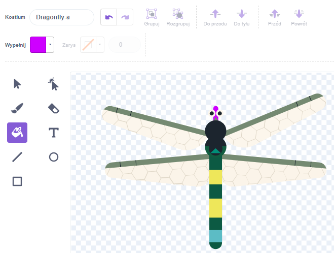
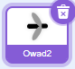
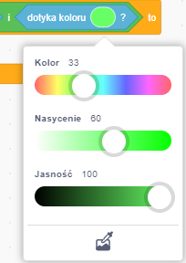

## Więcej pokarmu

<div style="display: flex; flex-wrap: wrap">
<div style="flex-basis: 200px; flex-grow: 1; margin-right: 15px;">
Ważka potrzebuje dokonać wyboru owada.
</div>
<div>
{:width="300px"}
</div>
</div>

--- task ---

Kliknij prawym przyciskiem myszy duszka **Owad** na liście duszków pod sceną i wybierz **duplikuj**.



--- /task ---

Make this insect look different to the fly.

--- task ---

Click on the **Costumes** tab and create a different flying insect.

+ Use the **Fill** tool to change the colour of this insect.
+ **Paint** your own insect costume.
+ **Add** another bug costume from Scratch.

--- /task ---

Owad zostaje zjedzony, nawet jeśli dotknie skrzydła lub ogona ważki.

Aby Twoja aplikacja była bardziej realistyczna, popraw to, by owad był zjadany tylko po dotknięciu buzi ważki. Możesz użyć bloku `dotyka koloru`{:class="block3sensing"}, aby owad został zjedzony tylko wtedy, gdy dotknie określonego koloru na **Ważce**.

--- task ---

Wybierz duszka **Ważka** i kliknij zakładkę **Kostiumy**.

Użyj narzędzia do wypełniania, aby wypełnić buzię **Ważki**. My użyliśmy fioletu:



--- /task ---

You need to check that the new sprite is touching the **Dragonfly** sprite `and`{:class="block3operators"} touching the colour of the dragonfly's mouth.

--- task ---

Select your new sprite and click on the **Code** tab.

Przeciągnij blok `i`{:class="block3operators"} do wnętrza bloku `jeżeli`{:class="block3control"}.

The `<touching [Dragonfly v] ?>`{:class="block3sensing"} block will pop out, drag it into a space in the `and`{:class="block3operators"} block:



```blocks3
when flag clicked
show
forever
move [3] steps 
if on edge, bounce
+if <<touching [Dragonfly v] ?> and <>> then
broadcast [food v]
hide
go to (random position v)
show
end
end
```

--- /task ---

--- task ---

Drag a `touching color`{:class="block3sensing"} block into the other space of the `and`{:class="block3operators"} block:

```blocks3
when flag clicked
show
forever
move [3] steps
if on edge, bounce
+if <<touching [Dragonfly v] ?> and <touching color (#9966ff) ?>> then
broadcast [food v]
hide
go to (random position v)
show
end
end
```

If it doesn't have the colour of the dragonfly's mouth selected, click on the colour circle and then click on the **Eyedropper** tool at the bottom to select a colour.



Click on the dragonfly's mouth on the Stage to set the colour:


**Tip:** If the small mouth is hard to select, make the **Dragonfly** sprite bigger.

--- /task ---

--- task ---

**Test:** Check the dragonfly can only eat the second insect with its mouth.

--- /task ---

--- save ---

