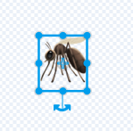

## Ulepsz swój projekt

Na tym etapie spróbuj dodać więcej owadów, zmieniając wygląd i zachowanie projektu.

{:width="300px"}

### Dodaj więcej owadów

Dodaj więcej owadów. Być może będziesz musiał/musiała przyspieszyć ich poruszanie się, aby ważce było trudniej je złapać.

Możesz namalować własne owady lub spróbować dodać emotkę komara!

--- task ---

Użyj klawiatury emoji, aby dodać duszka **emotka komara**.

Zduplikuj istniejącego duszka **owad**, a następnie kliknij zakładkę **Kostiumy**. **Pomaluj** nowy kostium i wybierz narzędzie **Tekst**. Zamiast wpisywać tekst, użyj skrótu klawiaturowego klawiatury emotek dla swojego systemu operacyjnego:

Windows - przycisk Windows + '.' MacOS - ctrl + cmd + spacja Linux - ctrl + '.'

Wybierz emoji **Komar**, aby wstawić go do edytora Malowania. Użyj narzędzia **Wybierz** (strzałka), aby wyśrodkować, zmienić rozmiar i obracać komara, aż będziesz z niego zadowolony.

**Wskazówka:** Emotki mogą wyglądać inaczej na różnych komputerach, więc mogą nie wyglądać tak samo na tablecie i komputerze stacjonarnym. Niektóre emotki nie są dostępne na pewnych komputerach, ale większość nowoczesnych komputerów je obsługuje.

--- /task ---

--- task ---

Użyj Plecaka, aby wymieniać się ze znajomymi owadami z ich projektów „Wyhoduj ważkę”.

[[[scratch-backpack]]]

--- /task ---

--- task ---

**Wskazówka:** Sprawdź, czy wszystkie twoje duszki i kostiumy mają odpowiednie imiona. Ułatwi to zrozumienie projektu, jeśli wrócisz do niego później.

**Wskazówka:** Upewnij się, że Twój kod jest czytelnie rozmieszczony w obszarze Kod. Kliknij prawym przyciskiem myszy obszar Kod i wybierz **Posprzątaj bloki**, aby Scratch uporządkował kod.

--- /task ---

--- collapse ---
---
title: Ukończony projekt
---

Tutaj możesz zobaczyć [ukończony projekt](https://scratch.mit.edu/projects/521688740/){:target="_blank"}.

--- /collapse ---

--- save ---
