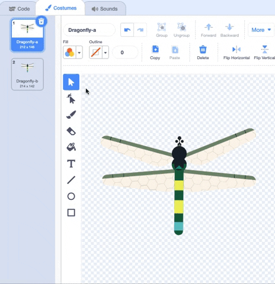

## Preparando o cenário

<div style="display: flex; flex-wrap: wrap">
<div style="flex-basis: 200px; flex-grow: 1; margin-right: 15px;">
Você vai definir a cena. Escolha sua imagem de fundo e adicione uma libélula que segue o ponteiro do mouse ao redor do cenario.
</div>
<div>
{:width="300px"}
</div>
</div>

--- task ---

Abra o [projeto inicial Cresça uma libélula](https://scratch.mit.edu/projects/535695413/editor){:target="_ blank"}. Scratch will open a blank project in a new browser tab.

--- /task ---

--- task ---

Click **Choose a Backdrop** and add a backdrop of your choice. Usamos o cenário **Jurassic**.


--- /task ---

--- task ---

Clique em **Escolha um Sprite** e procure por `dragonfly`, então adicione o sprite **Dragonfly**.


--- /task ---

--- task ---

Adicione um script para fazer o sprite **Dragonfly** seguir o ponteiro do mouse (ou seu dedo):


```blocks3
when flag clicked
set size to [25] % // to start small
forever
point towards (mouse-pointer v)
move [5] steps
end
```
--- /task ---

--- task ---

**Teste:** Clique na bandeira verde e faça o sprite **Dragonfly** se mover pelo cenario. A libélula está se movendo como você esperava?

--- /task ---

O traje Dragonfly não está voltado para a direita, então a cabeça do sprite **Dragonfly** não está apontando para o ponteiro do mouse.

--- task ---

Clique na aba **Costumes** e use a ferramenta **Select** (seta) para selecionar a fantasia.

Use a ferramenta **Rotate** na parte inferior do traje selecionado para virar o traje **Dragonfly** para a direita.



--- /task ---

--- task ---

**Teste:** Clique na bandeira verde e veja como a libélula se move agora.

--- /task ---

As asas da libélula fazem um som esvoaçante enquanto vibram. Você pode editar um som no Scratch para criar seu próprio som.

--- task ---

Adicione o som **Crank** ao sprite **Dragonfly**.

[[[generic-scratch3-sound-from-library]]]


--- /task ---

--- task ---

**Test:** Click the **Play** button so you can hear the sound.

--- /task ---

O som **Crank** é muito longo e muito lento para asas de libélula.

--- task ---

Selecione o final do som usando o cursor ou o dedo.

Clique em **Copy to New** para criar um novo som apenas com a parte selecionada:


--- /task ---

--- task ---

Renomeie seu novo som de **Crank2** para `Wings`. 

--- /task ---

--- task ---

**Test:** Play the new sound. Click the **Faster** button a few times until you like the result:


--- /task ---

--- task ---

If you like, you can select the very end of the **Wings** sound, and then click **Delete** to remove it:


--- /task ---

--- task ---

Now add a block to play the **Wings** sound when the dragonfly moves:


```blocks3
when flag clicked
set size to [25] %
forever
+start sound [Wings v]
point towards (mouse-pointer v)
move [5] steps
end
```
--- /task ---

--- task ---

**Test:** Try out your dragonfly movement and sound effect.

--- /task ---

--- save ---
