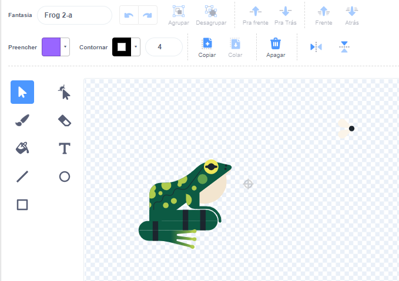
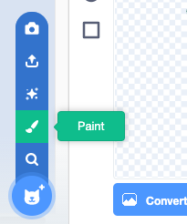

## Uma mosca para comer

<div style="display: flex; flex-wrap: wrap">
<div style="flex-basis: 200px; flex-grow: 1; margin-right: 15px;">
Você adicionará um inseto para a libélula comer. 
</div>
<div>
{:width="300px"}
</div>
</div>

Há uma mosca no sprite **Frog 2** que você pode usar.

--- task ---

Adicione o ator**Frog 2** ao seu projeto. Renomeie o sprite para `Insect`:


--- /task ---

Você só precisa da mosca, não do sapo.

--- task ---

Clique no ícone **Fantasias**. Clique na mosca para selecioná-la e clique no ícone **Copy**.



--- /task ---

--- task ---

Adicione uma nova fantasia ao sprite usando a opção **Paint**:



--- /task ---

--- task ---

Clique no ícone **Paste** para colar o sprite no novo traje. Arraste a mosca para o **centro** para que ela se alinhe com a mira.

Rename your costume `Insect` and delete the other costumes, as you won't need those:


--- /task ---

--- task ---

Aumente o tamanho da mosca para que seja mais fácil ver e pegar:


--- /task ---

--- task ---

Clique na guia **Code** e adicione um script para fazer o sprite **Insect** saltar:


```blocks3
when flag clicked
forever
move [3] steps
if on edge, bounce
end
```

O bloco `if on edge, bounce`{:class="block3motion"} verifica se o sprite atingiu a borda do cenario e aponta o sprite em uma direção diferente, caso tenha alcançado.

--- /task ---

Você quer que o sprite **Insect** `esconda`{:class="block3looks"} `if`{:class="block3control"} ele for comido pelo sprite **Dragonfly**.

--- task ---

Adicione um bloco `if`{:class="block3control"} ao script de movimento do sprite **Insect**:

```blocks3
when flag clicked
forever
move [3] steps
if on edge, bounce
+if < > then 
end
```
--- /task ---

O `if`{:class="block3control"} tem uma entrada em forma de hexágono. Isso significa que você pode colocar uma **condição ** aqui.

Quando o bloco `if`{:class="block3control"} for executado, o Scratch verificará a condição. Se a condição for 'true' `então`{:class="block3control"} o código dentro do bloco `if`{:class="block3control"} será executado.

Você quer que o inseto `esconda`{:class="block3looks"} `if`{:class="block3control"} é `tocando`{:class="block3sensing"} o sprite **Dragonfly**.

--- task ---

Arraste um `tocando [Dragonfly v]`{:class="block3sensing"} para o bloco `if`{:class="block3control"}. Adicione um bloco `hide`{:class="block3looks"} dentro do bloco `if`{:class="block3control"}.

```blocks3
when flag clicked
forever
move [3] steps
if on edge, bounce
+if <touching [Dragonfly v] ?> then // change from 'mouse-pointer'
+hide // eaten
end
```

--- /task ---

--- task ---

**Teste:** Teste seu código e controle a libélula para comer a mosca. A mosca deve desaparecer.

--- /task ---

A libélula não ficará muito grande se puder comer apenas uma mosca!

--- task ---

Add blocks to make the hidden insect sprite `go to a random position`{:class="block3motion"} on the Stage, `wait`{:class="block3control"} for one second then `show`{:class="block3looks"}:

```blocks3
when flag clicked
+show // show at the start
forever
move [3] steps
if on edge, bounce
if <touching [Dragonfly v] ?> then
hide
+go to (random position v)
+wait [1] seconds
+show // to look like a new fly
end
end
```

--- /task ---

--- task ---

**Teste:** Teste se sua libélula agora pode comer muitas moscas.

Make sure you have added the `show`{:class="block3looks"} block at the start.

--- /task ---

**Dica:** Você pode clicar no botão vermelho **Stop** acima do Palco se quiser que a libélula fique parada enquanto você adiciona mais código.

--- save ---
