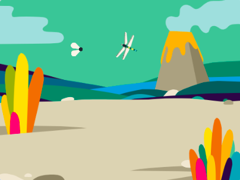
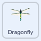

## Movimento aprimorado

<div style="display: flex; flex-wrap: wrap">
<div style="flex-basis: 200px; flex-grow: 1; margin-right: 15px;">
A libélula 'falha' e muda de direção muito rápido se o ponteiro do mouse estiver tocando a libélula. Você verificará outra condição para corrigir isso.
</div>
<div>
{:width="300px"}
</div>
</div>

--- task ---

Selecione o **Dragonfly** e encontre o script que começa com `quando o sinalizador clicou em`{:class="block3events"}.

Drag an `if`{:class="block3control"} inside the `forever`{:class="block3control"} block. The blocks inside the `forever`{:class="block3control"} will move inside the `if`{:class="block3control"}.



```blocks3
when flag clicked
set size to [25] %
forever
+if < > then
start sound [Wings v]
point towards (mouse-pointer v)
move [5] steps
end
end
```
--- /task ---

--- task ---

Em seguida, arraste um bloco `not`{:class="block3operators"} para dentro do bloco `if`{:class="block3control"} e um `touching (mouse-pointer)`{:class="block3sensing"} dentro dele.

```blocks3
when flag clicked
set size to [25] %
forever
+if <not <touching [mouse-pointer v] ?> > then
start sound [Wings v]
point towards (mouse-pointer v)
move [5] steps
end
end
```

--- /task ---

--- task ---

**Teste:** Verifique se a falha foi corrigida, e o Dragonfly só se move quando `não`{:class="block3operators"} `touching (mouse-pointer)`{:class="block3sensing"}.

--- /task ---

--- task ---

Try a different condition that makes the dragonfly move when it is far enough from the mouse-pointer:

```blocks3
<(distance to [mouse-pointer v]) > [50]>
```

--- /task ---

--- save ---
