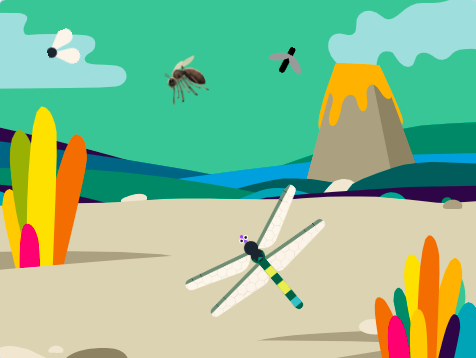
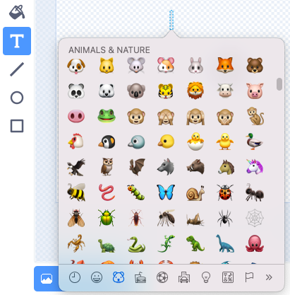
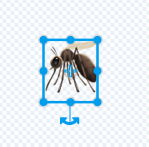
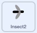

## Desafio

<div style="display: flex; flex-wrap: wrap">
<div style="flex-basis: 200px; flex-grow: 1; margin-right: 15px;">
Change the way your insects behave and add more insects.
</div>
<div>
{:width="300px"}
</div>
</div>

--- task ---

Change the speed of the dragonfly.

--- /task ---

--- task ---

Change the size that the dragonfly needs to grow to reach full size.

--- /task ---

--- task ---

Change the first **Insect** so that it can only be eaten with the dragonfly's mouth.

--- /task ---

### Adicione mais insetos

Você pode pintar seus próprios insetos ou tentar adicionar um mosquito emoji!

--- task ---

Use the emoji keyboard to add a **Mosquito emoji** sprite.

Duplicate an existing **insect** sprite then click on the **Costumes** tab. **Paint** a new costume and select the **Text** tool. Em vez de digitar texto, use o atalho de teclado emoji para seu sistema operacional:

- Windows - <kbd>⊞ Win</kbd> + <kbd>.</kbd>
- MacOS - <kbd>control</kbd> + <kbd>command</kbd> + <kbd>space</kbd>
- Linux - <kbd>ctrl</kbd> + <kbd>.</kbd>



Select the **Mosquito** emoji to insert it into the Paint editor. Use a ferramenta **Select** (seta) para centralizar, redimensionar e girar seu mosquito até ficar satisfeito com ele.



**Dica:** Emojis podem parecer diferentes em computadores diferentes, então eles podem não ter a mesma aparência em um tablet e um computador desktop. Alguns emojis não estão disponíveis em alguns computadores, mas a maioria dos computadores modernos os suporta.

--- /task ---

### Create random movement

Use the `pick random`{:class="block3operators"} block to make the insect move in a more natural way.

{:width="300px"}

--- task ---

Adicione um script **Insect 2** para fazê-lo apontar em uma direção aleatória a cada 1–3 segundos.



```blocks3
when flag clicked
forever // Keep changing direction
point in direction (pick random [0] to [259])
wait (pick random [1] to [3]) seconds
end
```

--- /task ---

--- task ---

**Test:** Run your project and watch how the sprite moves.

--- /task ---

--- task ---

Drag this script to the other **Insect** sprite to make it move randomly.

--- /task ---

### Share you insects

--- task ---

Use sua Backpack para trocar insetos com seus amigos de seus projetos 'Grow a Dragonfly'.

Send the link of your project to your friend who can go inside the project, click on Backpack (the one under the code space) and drag and drop the sprite.

[[[scratch-backpack]]]

--- /task ---

--- task ---

Check each sprite and costume has a name that describes the image. This makes your project easier to understand if you come back to it later.

--- /task ---

--- task ---

Right-click on the Code area and choose **Clean up Blocks** to get Scratch to tidy your code.

--- /task ---

--- save ---
