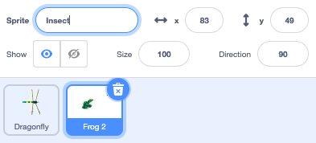
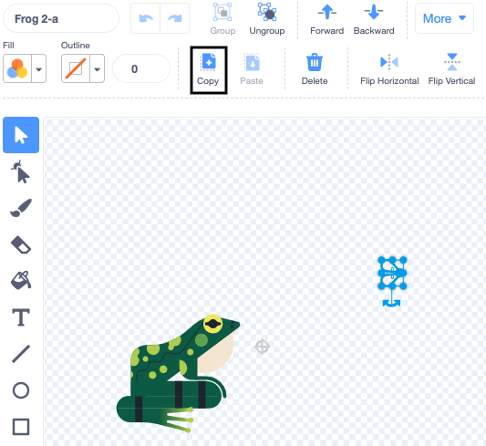
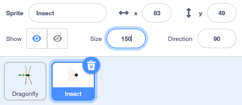

## తినడానికి ఒక ఈగ

<div style="display: flex; flex-wrap: wrap">
<div style="flex-basis: 200px; flex-grow: 1; margin-right: 15px;">
మీరు తూనీగ తినడానికి ఒక కీటకాన్ని జోడిస్తారు. 
</div>
<div>
{:width="300px"}
</div>
</div>

**Frog 2** sprite లో మీరు ఉపయోగించగల కీటకం ఉంది.

--- task ---

మీ ప్రాజెక్ట్‌కి **Frog 2** sprite ని జోడించండి. Sprite పేరును `Insect` గా మార్చండి:




--- /task ---

మీకు ఈగ మాత్రమే అవసరం, కప్ప కాదు.

--- task ---

**Costumes** ట్యాబ్‌పై క్లిక్ చేయండి. దీన్ని ఎంచుకోవడానికి ఈగ పై క్లిక్ చేసి, ** Copy** చిహ్నంపై క్లిక్ చేయండి.



--- /task ---

--- task ---

**Paint** ఎంపికను ఉపయోగించి sprite కి కొత్త costume లను జోడించండి:


--- /task ---

--- task ---

కొత్త costume లలో sprite ను అతికించడానికి **Paste** చిహ్నంపై క్లిక్ చేయండి. ఈగను **centre ** లోకి డ్రాగ్ చేయండి, తద్వారా అది క్రాస్‌హైర్‌తో వరుసలో ఉంటుంది.

Rename your costume `Insect` and delete the other costumes, as you won't need those:


--- /task ---

--- task ---

ఈగ యొక్క పరిమాణాన్ని పెంచండి, తద్వారా చూడటం మరియు పట్టుకోవడం సులభం:



--- /task ---

--- task ---

**Code** ట్యాబ్‌పై క్లిక్ చేసి, **Insect** sprite బౌన్స్ అయ్యేలా చేయడానికి స్క్రిప్ట్‌ను జోడించండి:


```blocks3
when flag clicked
forever
move [3] steps
if on edge, bounce
end
```

`if on edge, bounce`{:class="block3motion"} బ్లాక్, sprite Stage అంచుకు చేరుకుందో లేదో తనిఖీ చేస్తుంది మరియు sprite ఒకవేళ అంచుకు చేరితే దానిని వేరే దిశలో పంపుతుంది.

--- /task ---

`if`{:class="block3control"} **Dragon fly** sprite దానిని తిన్నట్లయితే, **Insect ** sprite `hide`{:class="block3looks"} అవ్వాలని మీరు అనుకొంటారు.

--- task ---

`if`{:class = "block3control"} బ్లాక్ ని **Insect** sprite యొక్క కదలిక స్క్రిప్ట్ కు జోడించండి:

```blocks3
when flag clicked
forever
move [3] steps
if on edge, bounce
+if < > then 
end
```
--- /task ---

`if`{:class="block3control"} షడ్భుజి ఆకారపు ఇన్‌పుట్‌ని కలిగి ఉంటుంది. అంటే మీరు ఇక్కడ **condition** పెట్టచ్చు.

`if`{:class="block3control"} బ్లాక్, రన్ అయినప్పుడు, Scratch కండిషన్ కోసం తనిఖీ చేస్తుంది. కండిషన్ 'true' `then`{:class="block3control"} `if`{:class="block3control"} బ్లాక్ రన్ అవుతుంది.

`if`{: class = "block3control"} అది **Dragonfly** sprite కు `touching`{: class = "block3sensing"} అయితే మీరు కీటకం `hide`{: class = "block3looks"} అవ్వాలని కోరుకొంటారు.

--- task ---

`touching [Dragonfly v]`{:class="block3sensing"}ని `if`{:class="block3control"} బ్లాక్‌లోకి లాగండి. `if`{:class="block3control"} బ్లాక్‌లో `hide`{:class="block3looks"} బ్లాక్‌ని జోడించండి.

```blocks3
when flag clicked
forever
move [3] steps
if on edge, bounce
+if <touching [Dragonfly v] ?> then // change from 'mouse-pointer'
+hide // eaten
end
```

--- /task ---

--- task ---

**పరీక్ష:** మీ కోడ్‌ని పరీక్షించండి మరియు ఈగని తినడానికి తూనీగని నియంత్రించండి. ఈగ అదృశ్యం కావాలి.

--- /task ---

తూనీగ ఒక్క ఈగను మాత్రమే తినగలిగితే పెద్దది కాదు!

--- task ---

Add blocks to make the hidden insect sprite `go to a random position`{:class="block3motion"} on the Stage, `wait`{:class="block3control"} for one second then `show`{:class="block3looks"}:

```blocks3
when flag clicked
+show // show at the start
forever
move [3] steps
if on edge, bounce
if <touching [Dragonfly v] ?> then
hide
+go to (random position v)
+wait [1] seconds
+show // to look like a new fly
end
end
```

--- /task ---

--- task ---

**పరీక్ష:** మీ తూనీగ ఇప్పుడు చాలా ఈగలను తినగలదని పరీక్షించండి.

Make sure you have added the `show`{:class="block3looks"} block at the start.

--- /task ---

**చిట్కా:** మీరు మరింత కోడ్‌ను జోడించేటప్పుడు తూనీగ నిశ్శబ్దంగా ఉండాలని మీరు కోరుకుంటే, మీరు Stage పైన ఉన్న ఎరుపు రంగు **Stop** బటన్ క్లిక్ చేయచ్చు.

--- save ---
