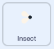

## పూర్తి పరిమాణానికి పెంచండి

<div style="display: flex; flex-wrap: wrap">
<div style="flex-basis: 200px; flex-grow: 1; margin-right: 15px;">
తూనీగ ఈగను తిన్నప్పుడు మీరు దానిని పెరిగేలా చేస్తారు మరియు అది పూర్తి పరిమాణానికి చేరుకున్న తరువాత ఆగిపోతుంది.
</div>
<div>
{:width="300px"}
</div>
</div>

The Dragonfly needs to grow when it eats a fly.

ఏదైనా విషయం గురించి మీరు మరొక sprite కు తెలియజేయవలసి వచ్చినప్పుడు, మీరు [Broadcastimg spells](https://projects.raspberrypi.org/en/projects/broadcasting-spells){:target="_blank"} లో చేసిన విధంగా `broadcast`{:class="block3events"} బ్లాక్‌ని ఉపయోగించవచ్చు.

--- task ---

కొత్త సందేశం `food`{:class="block3events"} ను **Insect** sprite కి అందించడానికి `broadcast`{:class="block3events"} బ్లాక్‌ని జోడించండి:



```blocks3
when flag clicked
show // show at the start
forever
move [3] steps
if on edge, bounce
if <touching [Dragonfly v] ?> then
+broadcast [food v]
hide
go to (random position v)
wait [1] seconds
show
end
end
```
--- /task ---

**Dragonfly** sprite, `food`{:class="block3events"} సందేశాన్ని అందుకున్నప్పుడు అది పెరగాలి.

--- task ---

**Dragonfly** sprite ని ఎంచుకుని, ఈ స్క్రిప్ట్‌ని జోడించండి:


```blocks3 
when I receive [food v]
change size by [5]
```

--- /task ---

--- task ---

తూనీగకి **Chomp** ధ్వనిని కీటకాన్ని తిన్నప్పుడు `start`{:class="block3sound"} అయ్యేలా జోడించండి:

```blocks3 
when I receive [food v]
+start sound [Chomp v]
change size by [5]
```
--- /task ---

--- task ---

**పరీక్ష:** తూనీగ ఎదుగుదలను పరీక్షించడానికి మీ ప్రాజెక్ట్‌ను అమలు చేయండి మరియు అది ఈగను తిన్నప్పుడు శబ్దం చేస్తుంది.

--- /task ---

తూనీగ దాని పూర్తి పరిమాణానికి చేరుకున్నప్పుడు, ఆట మిమ్మల్ని అభినందిస్తుంది మరియు ఆగిపోతుంది.

--- task ---

`if`{:class = "block3control"} బ్లాక్ ని జోడించండి.

```blocks3
when I receive [food v]
start sound [Chomp v]
change size by [5]
+if < > then
end
```

--- /task ---

`size`{:class="block3looks"} `=`{:class="block3operators"} `100%`అయినప్పుడు తూనీగ పూర్తి పరిమాణంలో ఉంటుంది.

--- task ---

First, add an `=`{:class="block3operators"} operator into the hexagon-shaped input:

```blocks3
when I receive [food v]
start sound [Chomp v]
change size by [5]
+if <[ ] = [ ]> then
end
```
--- /task ---

--- task ---

`size`{:class="block3looks"} వేరియబుల్‌ని జోడించి `100` విలువను టైప్ చేయడం ద్వారా, షరతుని బిల్డ్ చేయండి:

```blocks3
when I receive [food v]
start sound [Chomp v]
change size by [5]
+if <(size) = [100]> then
end
```
--- /task ---

--- task ---

బ్లాక్‌లను జోడించండి తద్వారా `if`{:class="block3control"} కండిషన్ నిజం అయితే `then`{:class="block3control"} తూనీగ ఒక 'end' సందేశం `broadcast`{:class="block3events"} చేస్తుంది మరియు `say`{:class="block3looks"} `I got to full size!`

చివరగా, తూనీగ యొక్క ఇతర స్క్రిప్ట్లు ఆగిపోయేలాగా `stop all`{:class="block3control"} బ్లాక్‌ని జోడించండి:

```blocks3
when I receive [food v]
start sound [Chomp v]
change size by [5]
if <(size) = [100]> then
+broadcast [end v]
+say [I got to full size!]
+stop [other scripts in sprite v] // change from 'all'
end
```
--- /task ---

--- task ---

ప్రస్తుతానికి, ప్రాజెక్ట్ ముగిసిన తర్వాత కూడా ఈగ కదులుతుంది. ఈ స్క్రిప్ట్‌ను **Insect** sprite కి జోడించండి.


```blocks3
when I receive [end v]
stop [other scripts in sprite v]
```

--- /task ---

--- task ---

**పరీక్ష:** ఆకుపచ్చ జెండాను క్లిక్ చేయండి మరియు మీ డ్రాగన్‌ఫ్లై పూర్తి పరిమాణాన్ని చేరుకునే వరకు ఈగలను తింటూ ఉండనివ్వండి.

--- /task ---

--- save ---
