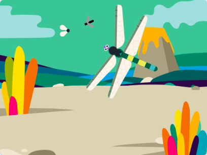
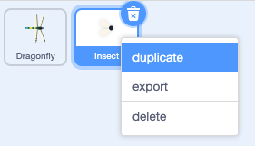

## మరింత ఆహారం

<div style="display: flex; flex-wrap: wrap">
<div style="flex-basis: 200px; flex-grow: 1; margin-right: 15px;">
తూనీగకి కీటకాల ఎంపిక అవసరం.
</div>
<div>
{:width="300px"}
</div>
</div>

--- task ---

Sprite జాబితాలో **Insect** sprite పై రైట్-క్లిక్ చేసి, డ్రాప్-డౌన్ మెనులో **duplicate** ను సెలెక్ట్ చేసుకోండి.



--- /task ---

ఈ కీటకం ఈగకి భిన్నంగా కనిపిస్తే అది ఉపయోగకరంగా ఉంటుంది.

--- task ---

**Costumes** ట్యాబ్‌పై క్లిక్ చేయండి.

+ ఈ కీటకం రంగును మార్చడానికి **Fill** సాధనాన్ని ఉపయోగించండి
+ మీ స్వంత కీటకం costume లను **Paint** చేయండి
+ Scratch నుండి మరొక కీటకం costume లను **చేర్చండి**

--- /task ---

తూనీగ రెక్క లేదా తోకను తాకినా కూడా కీటకం తినబడుతుంది.

మీ యాప్‌ను మరింత వాస్తవికంగా చేయడానికి, తూనీగ నోటి ద్వారా కీటకాలను తినే విధంగా దీన్ని పరిష్కరించండి. మీరు `touching color`{:class="block3sensing"} బ్లాక్‌ని ఉపయోగించవచ్చు కాబట్టి **Dragonfly**పై నిర్దిష్ట రంగును తాకినట్లయితే మాత్రమే కీటకం తినబడుతుంది.

--- task ---

**Dragonfly** sprite ని ఎంచుకుని, **Costumes** ట్యాబ్‌పై క్లిక్ చేయండి.

**Dragonfly**నోటిని పూరించడానికి ఫిల్ సాధనాన్ని ఉపయోగించండి. మనము ఊదా రంగును ఉపయోగించాము:


--- /task ---

You need to check that the new sprite is touching the **Dragonfly** sprite `and`{:class="block3operators"} touching the colour of the dragonfly's mouth.

--- task ---

Select your new sprite and click on the **Code** tab.

`if`{:class="block3control"} బ్లాక్‌లో `and`{:class="block3operators"} బ్లాక్‌ని డ్రాగ్ చేయండి.

`if`{:class="block3control"} బ్లాక్‌లో `and`{:class="block3operators"} బ్లాక్‌ని డ్రాగ్ చేయండి.


```blocks3
when flag clicked
show
forever
move [3] steps 
if on edge, bounce
+if <<touching [Dragonfly v] ?> and <>> then
broadcast [food v]
hide
go to (random position v)
show
end
end
```

--- /task ---

--- task ---

Drag a `touching color`{:class="block3sensing"} block into the other space of the `and`{:class="block3operators"} block:

```blocks3
when flag clicked
show
forever
move [3] steps
if on edge, bounce
+if <<touching [Dragonfly v] ?> and <touching color (#9966ff) ?>> then
broadcast [food v]
hide
go to (random position v)
show
end
end
```

`touching color`{:class="block3sensing"} బ్లాక్‌ని `and`{:class="block3operators"} బ్లాక్‌ యొక్క కుడివైపుకి లాగండి:


తూనీగ నోటి రంగు అందులో లేకపోతే, కలర్ సర్కిల్‌పై క్లిక్ చేసి, ఆపై రంగును ఎంచుకోవడానికి **Eyedropper** సాధనాన్ని ఉపయోగించండి.


రంగును మ్యాచ్ అయ్యేలా సెట్ చేయడానికి Stage పై ఉన్న తూనీగ నోటిపై క్లిక్ చేయండి:

--- /task ---

--- task ---

**Test:** Check the dragonfly can only eat the second insect with its mouth.

--- /task ---

--- save ---

