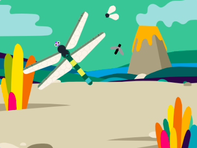

## యాదృచ్ఛికంగా కీటకాల కదలిక

<div style="display: flex; flex-wrap: wrap">
<div style="flex-basis: 200px; flex-grow: 1; margin-right: 15px;">
మీ యాప్‌లోని కీటకాలు చాలా వరకు ఊహాజనిత నమూనాలో కదులుతాయి, కానీ నిజ జీవితంలో వాటిని పట్టుకోవడం కష్టం. 

కీటకాన్ని మరింత సహజమైన రీతిలో తరలించడానికి మీరు `pick random`{:class="block3operators"} బ్లాక్‌ని ఉపయోగిస్తారు.
</div>
<div>
{:width="300px"}
</div>
</div>

--- task ---

ప్రతి 1-3 సెకన్లకు యాదృచ్ఛిక దిశలో పాయింట్ చేయడానికి **Insect 2** కి స్క్రిప్ట్‌ను జోడించండి.

```blocks3
when flag clicked
forever // Keep changing direction
point in direction (pick random [0] to [259])
wait (pick random [1] to [3]) seconds
end
```

--- /task ---

--- task ---

**పరీక్ష:** మీ ప్రాజెక్ట్‌ని అమలు చేయండి మరియు ఈగ ఎలా కదులుతుందో చూడండి. మీకు కావలసిన ప్రభావాన్ని పొందడానికి సంఖ్యలను మార్చడానికి ప్రయత్నించండి.

మీరు ఈ స్క్రిప్ట్‌ను **Insect** sprite కి కూడా డ్రాగ్ చేయవచ్చు, తద్వారా ఇది కూడా యాదృచ్ఛికంగా కదులుతుంది.

--- /task ---

--- task ---

కీటకాలు మీరు కోరుకున్న విధంగా ప్రవర్తించే వరకు వాటిని మార్చండి.

అవి `move`{:class="block3motion"} అడుగుల సంఖ్యను మీరు మార్చవచ్చు తద్వారా వాటిని వేగంగా లేదా నెమ్మదిగా చేయడానికి.

మీరు తూనీగ వేగాన్ని కూడా మార్చవచ్చు.

--- /task ---

--- task ---

డ్రాగన్‌ఫ్లై పూర్తి పరిమాణాన్ని చేరుకోవడానికి పెరగాల్సిన పరిమాణాన్ని కూడా మీరు మార్చవచ్చు.

మీరు మీ ప్రాజెక్ట్‌తో సంతృప్తిగా అయ్యే వరకు మార్పులు చేయండి.

--- /task ---

--- save ---
