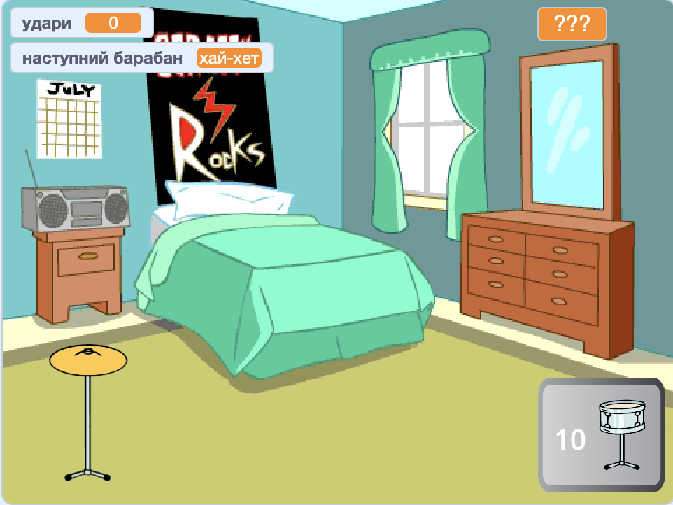

## Що далі?

Якщо ти йдеш напрямом [Більше Скретчу](https://projects.raspberrypi.org/en/raspberrypi/more-scratch), ти можеш перейти до проєкту [Барабанна зірка](https://projects.raspberrypi.org/en/projects/drum-star). У цьому проєкті ти створиш гру-клікер, де зароблятимеш удари, щоб грати на нових барабанах і на більших майданчиках.

--- print-only ---

--- /print-only ---

--- no-print ---

  <iframe allowtransparency="true" width="485" height="402" src="https://scratch.mit.edu/projects/embed/522323676/?autostart=false" frameborder="0"></iframe>

--- /no-print ---

Якщо ти хочеш далі досліджувати Скретч, спробуй один із цих [захопливих проєктів](https://projects.raspberrypi.org/en/projects?software%5B%5D=scratch&curriculum%5B%5D=%201).
