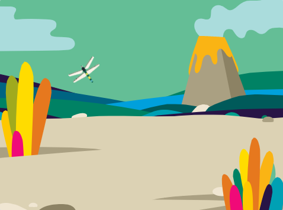
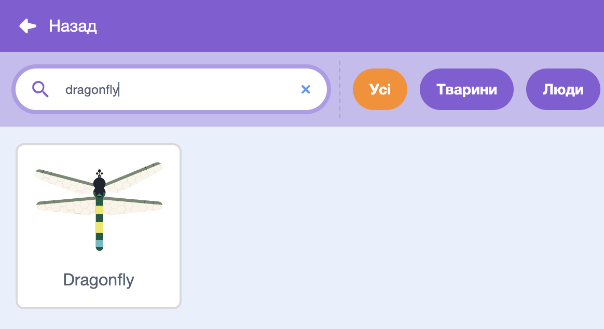
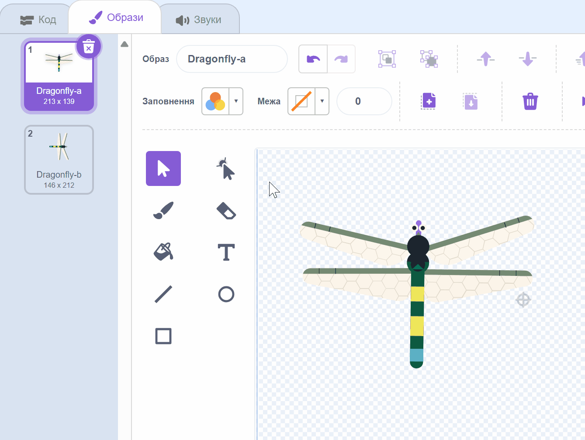
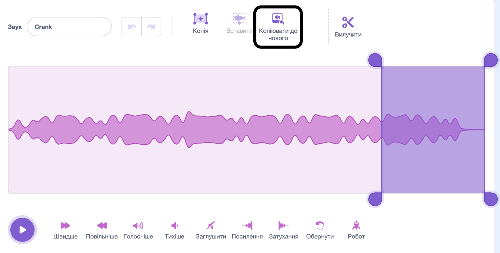
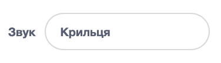
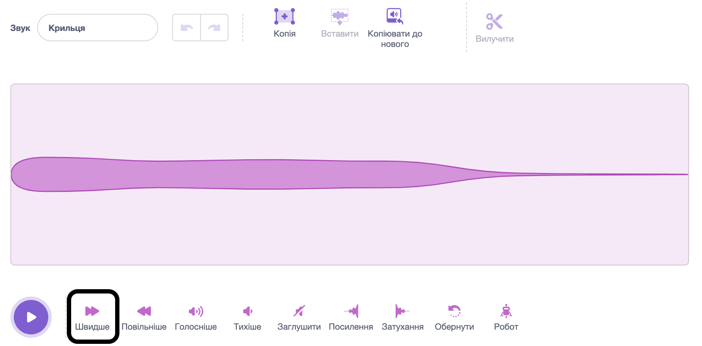
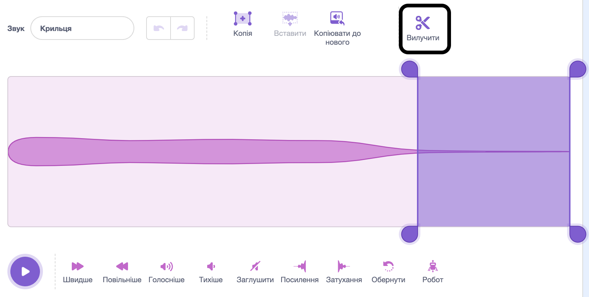

## Налаштуй сцену

<div style="display: flex; flex-wrap: wrap">
<div style="flex-basis: 200px; flex-grow: 1; margin-right: 15px;">
Спробуй налаштувати сцену. Вибери тло і додай бабку, яка слідує за курсором миші по Сцені.
</div>
<div>
{:width="300px"}
</div>
</div>

--- task ---

Відкрий [стартовий проєкт «Вирости бабку»](https://scratch.mit.edu/projects/535695413/editor){:target="_blank"}. Scratch will open a blank project in a new browser tab.

--- /task ---

--- task ---

Click **Choose a Backdrop** and add a backdrop of your choice. Ми обрали тло **Jurassic** («Юрський період»).


--- /task ---

--- task ---

Натисни на **Обрати спрайт** і введи у поле пошуку `dragonfly` («бабка»), після чого додай спрайт **Dragonfly**.




--- /task ---

--- task ---

Додай скрипт до спрайта **Dragonfly**, за допомогою якого той слідуватиме за вказівником (або твоїм пальцем):


```blocks3
when flag clicked
set size to [25] % // to start small
forever
point towards (mouse-pointer v)
move [5] steps
end
```
--- /task ---

--- task ---

**Протестуй:** натисни на зелений прапорець і змусь спрайт **Dragonfly** рухатися Сценою. Чи рухається твоя бабка так, як ти очікував/-ла?

--- /task ---

Образ бабки не дивиться праворуч, тому голова спрайта **Dragonfly** не повернута у напрямку вказівника.

--- task ---

Перейди на вкладку **Образи** і клікни на інструмент **Обрати** (стрілочка), щоб вибрати образ.

Використовуючи інструмент **Розвернути** у нижній частині вибраного образу, розверни образ **Dragonfly**, щоб він дивився праворуч.



--- /task ---

--- task ---

**Протестуй:** клікни на зелений прапорець і поглянь, як бабка рухається зараз.

--- /task ---

Крильця бабки тріпотять з особливим звуком під час польоту. Ти можеш відредагувати звук у Скретчі, щоб створити власний звук.

--- task ---

Додай звук **Crank** до спрайта **Dragonfly**.

[[[generic-scratch3-sound-from-library]]]


--- /task ---

--- task ---

Натисни на кнопку **Відтворити**, щоб прослухати звук.

--- /task ---

Звук **Crank** задовгий і надто повільний для крилець бабки.

--- task ---

Вибери кінець звуку, використовуючи вказівник миші або палець.

Натисни **Копіювати до нового**, щоб створити новий звук, де буде лише вибрана частина:



--- /task ---

--- task ---

Зміни назву свого нового звука з **Crank2** на `Крильця`. 

--- /task ---

--- task ---

**Test:** Play the new sound. Click the **Faster** button a few times until you like the result:



--- /task ---

--- task ---

If you like, you can select the very end of the **Wings** sound, and then click **Delete** to remove it:



--- /task ---

--- task ---

Now add a block to play the **Wings** sound when the dragonfly moves:


```blocks3
when flag clicked
set size to [25] %
forever
+start sound [Wings v]
point towards (mouse-pointer v)
move [5] steps
end
```
--- /task ---

--- task ---

**Test:** Try out your dragonfly movement and sound effect.

--- /task ---

--- save ---
