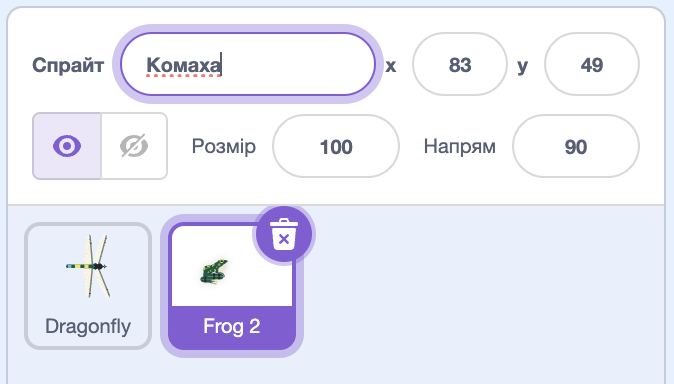
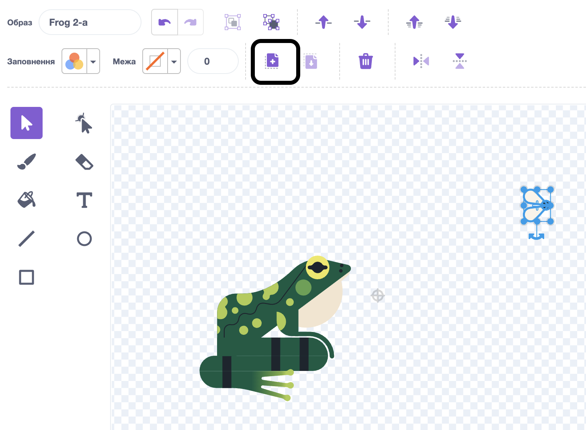
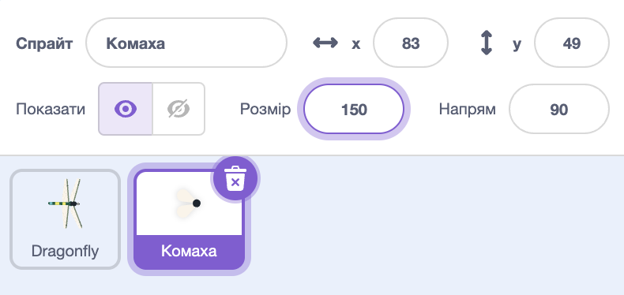
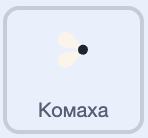

## Смачна муха

<div style="display: flex; flex-wrap: wrap">
<div style="flex-basis: 200px; flex-grow: 1; margin-right: 15px;">
Ти додаси комаху, яку бабка зможе зʼїсти. 
</div>
<div>
{:width="300px"}
</div>
</div>

<p style="border-left: solid; border-width:10px; border-color: #0faeb0; background-color: aliceblue; padding: 10px;">
Персонажі, які рухаються у грі самі по собі, інколи називаються <span style="color: #0faeb0">**мобами**</span>, скорочено від «мобільні». Можеш згадати приклад гри, у якій є моби?</p>

У спрайті **Frog 2** є муха, яку ти можеш використати.

--- task ---

Додай спрайт **Frog 2** («жаба 2») до свого проєкту. Зміни назву спрайта на `Комаха`:




--- /task ---

Тобі потрібна тільки комаха без жаби.

--- task ---

Перейди до вкладки **Образи**. Натисни на муху, щоб вибрати її, та клікни по іконці **Копія**.



--- /task ---

--- task ---

Додай новий образ до спрайта, використовуючи функцію **Малювати**:


--- /task ---

--- task ---

Натисни на іконку **Вставити**, щоб вставити спрайт у новий образ. Перетягни муху до **центру**, щоб вона зрівнялася з прицілом.

Можеш перейменувати свій образ на `Комаху` і видалити решту образів, бо вони тобі більше не потрібні:


--- /task ---

--- task ---

Збільш розмір мухи, щоб її було легше побачити і зловити:



--- /task ---

--- task ---

Перейди до вкладки **Код** і додай скрипт, за допомогою якого спрайт **Комаха** стрибатиме Сценою:



```blocks3
when flag clicked
forever
move [3] steps
if on edge, bounce
end
```

Блок `якщо на межі, відбити`{:class="block3motion"} перевіряє, чи спрайт дійшов до межі Сцени, і, якщо так, розвертає спрайт в інший напрямок.

--- /task ---

Тобі потрібно, щоб спрайт **Комаха** `сховався`{:class="block3looks"}, `якщо`{:class="block3control"} його зʼїдає спрайт **Dragonfly** («бабка»).

--- task ---

Додай блок `якщо`{:class="block3control"} до скрипту руху спрайта **Комаха**:


```blocks3
when flag clicked
forever
move [3] steps
if on edge, bounce
+if < > then 
end
```
--- /task ---

Блок `якщо`{:class="block3control"} має шестикутне поле вводу. Це означає, що ти можеш вставити туди **умову**.

Коли запускатиметься блок `якщо`{:class="block3control"}, Скретч перевірятиме цю умову. Якщо умова справджується, `то`{:class="block3control"} запуститься код всередині блока `якщо`{:class="block3control"}.

Тобі потрібно, щоб комаха `сховалась`{:class="block3looks"}, `якщо`{:class="block3control"} вона `торкається`{:class="block3sensing"} спрайта **Dragonfly**.

--- task ---

Перетягни блок `торкається [Dragonfly v]`{:class="block3sensing"} всередину блока `якщо`{:class="block3control"}. Додай блок `сховати`{:class="block3looks"} всередину блока `якщо`{:class="block3control"}.


```blocks3
when flag clicked
forever
move [3] steps
if on edge, bounce
+if <touching [Dragonfly v] ?> then // зміни зі «вказівника»
+hide // eaten
end
```

--- /task ---

--- task ---

**Протестуй:** перевір свій код і спрямуй бабку так, щоб вона зʼїла муху. Муха має зникнути.

--- /task ---

Бабка не виросте дуже великою, якщо зʼїсть лише одну муху!

--- task ---

Додай блоки до `перейти до випадкової позиції`{:class="block3motion"} на Сцені й дай своєму спрайту `зачекати`{:class="block3control"} одну секунду, а потім `показатися`{:class="block3looks"}:


```blocks3
when flag clicked
+show // показувати на початку
forever
move [3] steps
if on edge, bounce
if <touching [Dragonfly v] ?> then
hide
+go to (випадкова позиція v)
+wait [1] seconds
+show // виглядає як інша муха
end
end
```

--- /task ---

--- task ---

**Протестуй:** переконайся, що тепер твоя бабка може зʼїсти багато мух.

Не забудь додати блок `показати`{:class="block3looks"} на початку.

--- /task ---

**Порада:** ти можеш натиснути на червону кнопку **Зупинити** над Сценою, якщо ти хочеш, щоб бабка не стрекотала, поки ти додаєш код.

--- save ---
