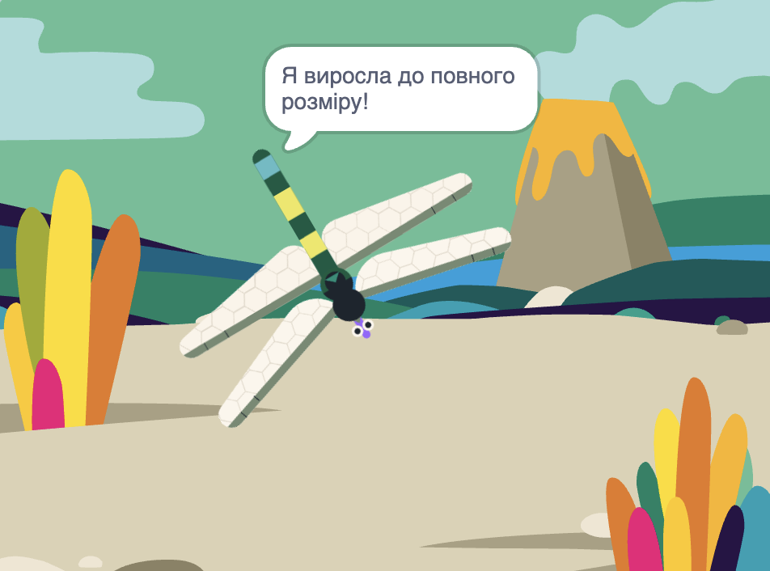

## Повний розмір

<div style="display: flex; flex-wrap: wrap">
<div style="flex-basis: 200px; flex-grow: 1; margin-right: 15px;">
Ти зробиш так, щоб бабка росла, коли зʼїдає муху, і переставала рости, коли досягне повного розміру.
</div>
<div>
{:width="300px"}
</div>
</div>

The Dragonfly needs to grow when it eats a fly.

Коли ти хочеш повідомити іншому спрайту, що щось сталося, ти можеш використати блок `оповістити`{:class="block3events"}, як у проєкті [Чарівні оповіщення](https://projects.raspberrypi.org/en/projects/broadcasting-spells){:target="_blank"}.

--- task ---

Додай блок `оповістити`{:class="block3events"} до спрайта **Комаха** з новим повідомленням `їжа`{:class="block3events"}:


```blocks3
when flag clicked
show // show at the start
forever
move [3] steps
if on edge, bounce
if <touching [Dragonfly v] ?> then
+broadcast [food v]
hide
go to (random position v)
wait [1] seconds
show
end
end
```
--- /task ---

Спрайт **Dragonfly** має вирости, коли отримає повідомлення `їжа`{:class="block3events"}.

--- task ---

Вибери спрайт **Dragonfly** і додай такий скрипт:


```blocks3 
when I receive [food v]
change size by [5]
```

--- /task ---

--- task ---

Додай звук **Chomp** до бабки і `відтвори`{:class="block3sound"} його, коли бабка зʼїдає комаху:

```blocks3 
when I receive [food v]
+start sound [Chomp v]
change size by [5]
```
--- /task ---

--- task ---

**Протестуй:** запусти свій проєкт, щоб перевірити, як бабка виростає і відтворює звук поглинання їжі, коли зʼїдає муху.

--- /task ---

Коли бабка досягне повного розміру, гра привітає тебе і зупиниться.

--- task ---

Додай блок `якщо`{:class="block3control"}.

```blocks3
when I receive [їжа v]
start sound [Chomp v]
change size by [5]
+if <[ ] = [ ]> then
end
```

--- /task ---

Бабка досягне повного розміру, коли `розмір`{:class="block3looks"} `=`{:class="block3operators"} `100%`.

--- task ---

First, add an `=`{:class="block3operators"} operator into the hexagon-shaped input:

```blocks3
when I receive [food v]
start sound [Chomp v]
change size by [5]
+if <[ ] = [ ]> then
end
```
--- /task ---

--- task ---

Заверши побудову умови за допомогою вбудованої змінної `розмір`{:class="block3looks"}, ввівши значення `100`:

```blocks3
when I receive [food v]
start sound [Chomp v]
change size by [5]
+if <(size) = [100]> then
end
```
--- /task ---

--- task ---

Додай блоки, щоб відбувалося наступне: `якщо`{:class="block3control"} умова справджується, `то`{:class="block3control"} бабка `оповістить`{:class="block3events"} за допомогою повідомлення «кінець» і `скаже`{:class="block3looks"} `Я досягла повного розміру!`

Наприкінці додай блок `зупинити все`{:class="block3control"}, щоб зупинити решту скриптів бабки:

```blocks3
when I receive [food v]
start sound [Chomp v]
change size by [5]
if <(size) = [100]> then
+broadcast [end v]
+say [I got to full size!]
+stop [other scripts in sprite v] // change from 'all'
end
```
--- /task ---

--- task ---

Зараз муха продовжує рухатися після закінчення проєкту. Додай цей скрипт до спрайта **Комаха**.


```blocks3
when I receive [end v]
stop [other scripts in sprite v]
```

--- /task ---

--- task ---

**Протестуй:** клікни на зелений прапорець і продовжуй їсти мух, доки твоя бабка не досягне повного розміру.

--- /task ---

--- save ---
