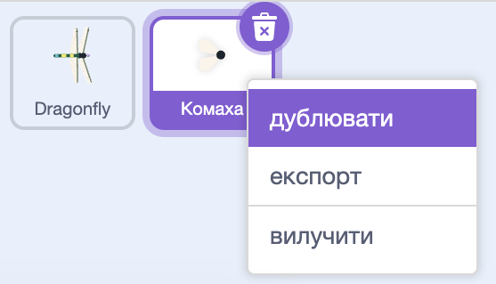
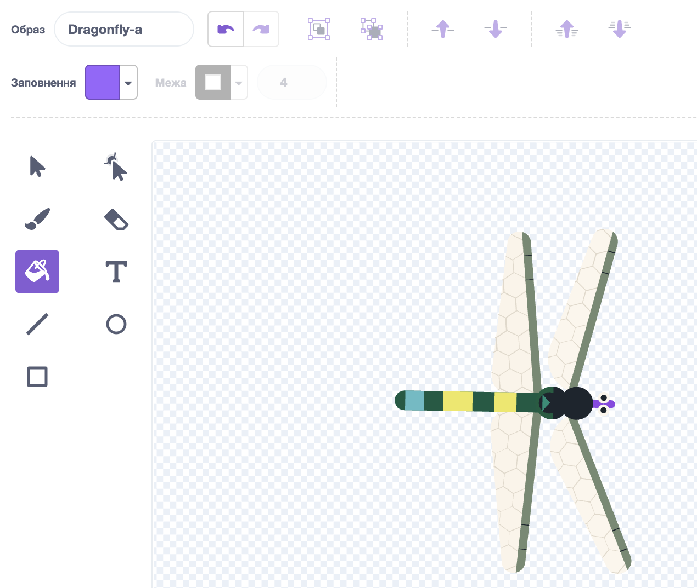
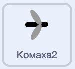
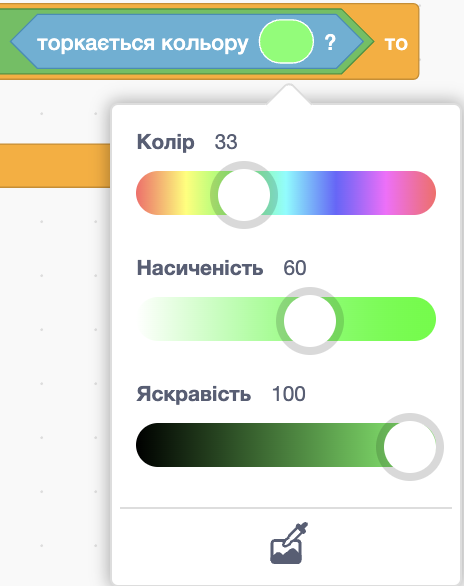

## Більше їжі

<div style="display: flex; flex-wrap: wrap">
<div style="flex-basis: 200px; flex-grow: 1; margin-right: 15px;">
Бабці потрібно більше різних комах.
</div>
<div>
{:width="300px"}
</div>
</div>

--- task ---

Клацни правою кнопкою миші на спрайт **Комаха** у списку спрайтів під Сценою і вибери **дублювати**.



--- /task ---

Тобі буде зручніше, якщо ця комаха має інший вигляд, ніж муха.

--- task ---

Перейди до вкладки **Образи**.

+ Використовуй інструмент **Заливка**, щоб змінити колір комахи.
+ **Намалюй** власний образ комахи.
+ **Додай** інший комашиний образ зі Скретчу

--- /task ---

Комаху зʼїдають, навіть якщо вона торкається крила або хвоста бабки.

Щоб твоя програма була більш реалістичною, зроби так, щоб бабка могла зʼїсти комаху лише ротом. Ти можеш використати блок `торкається кольору`{:class="block3sensing"}, щоб комаха зникала лише тоді, коли торкається певного кольору на спрайті **Dragonfly**.

--- task ---

Обери спрайт **Dragonfly** і перейди до вкладки **Образи**.

Використай інструмент заливки, що заповнити рот **бабки** кольором. Ми обрали фіолетовий:



--- /task ---

You need to check that the new sprite is touching the **Dragonfly** sprite `and`{:class="block3operators"} touching the colour of the dragonfly's mouth.

--- task ---

Select your new sprite and click on the **Code** tab.

Перетягни блок `і`{:class="block3operators"} у середину блока `якщо`{:class="block3control"}.

Перетягни блок `і`{:class="block3operators"} у середину блока `якщо`{:class="block3control"}.



```blocks3
when flag clicked
show
forever
move [3] steps 
if on edge, bounce
+if <<touching [Dragonfly v] ?> and <>> then
broadcast [food v]
hide
go to (random position v)
show
end
end
```

--- /task ---

--- task ---

Drag a `touching color`{:class="block3sensing"} block into the other space of the `and`{:class="block3operators"} block:

```blocks3
when flag clicked
show
forever
move [3] steps
if on edge, bounce
+if <<touching [Dragonfly v] ?> and <touching color (#9966ff) ?>> then
broadcast [food v]
hide
go to (random position v)
show
end
end
```

Перетягни блок `торкається кольору`{:class="block3sensing"} в праве поле блока `і`{:class="block3operators"}:



Якщо у цьому блоці не вибрано колір рота бабки, натисни на кольорове коло, а потім на інструмент **Піпетка**, щоб вибрати колір.


Клацни по роту бабки на Сцені, щоб вибрати відповідний колір:

--- /task ---

--- task ---

**Test:** Check the dragonfly can only eat the second insect with its mouth.

--- /task ---

--- save ---

